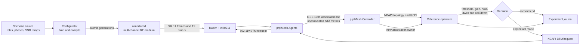

# Dynamic medium and optimizer guide

This lab separates RF stimulus, EasyMesh telemetry, policy decisions and
actuation. That separation is the main research contract: the optimizer may
observe only facts reported by prplMesh and may steer only through a normal
controller action. It never reads the scenario plan or wmediumd values.

## Closed loop



The four important boundaries are:

1. **Stimulus:** the configurator is the only scenario writer. It changes the
   live medium through `/run/prpl-wmediumd/control.sock` without restarting
   wmediumd or any mesh node.
2. **Measurement:** associated RCPI and candidate-link RCPI traverse the
   radio HAL, Agent, IEEE 1905, controller and NBAPI model.
3. **Decision:** the optimizer consumes an immutable normalized snapshot. A
   policy is a pure function of that snapshot plus explicit policy state.
4. **Action:** recommendation mode cannot change the mesh. Act mode requires
   `--yes-act`, uses a bounded BTM request and verifies physical and NBAPI
   convergence.

## Components and interfaces

| Component | Interface | Purpose |
|---|---|---|
| wmediumd | hwsim generic netlink | Receives and forwards simulated WLAN frames |
| wmediumd control | Unix `SOCK_SEQPACKET` | Atomic SNR generations, readback, restore and link dump |
| wmediumd metrics | read-only Unix socket | Frequency-qualified candidate-link SNR for the nl80211 monitor HAL |
| configurator | `.wmd` source and JSON event plan | Validates, binds and schedules deterministic medium changes |
| world compiler | JSON layout/mobility input | Produces reusable golden RF timelines with paths, walls and presence |
| prplMesh monitor HAL | read-only metrics socket | Converts lab SNR to RSSI and emits ordinary monitor events |
| prplMesh Agent | IEEE 1905 CMDUs | Reports associated and unassociated STA link metrics |
| prplMesh controller | `Device.WiFi.DataElements` on ubus | Owns topology, metrics and steering actions |
| topology adapter | loopback HTTP `/api/topology` on port 8092 | Read-only normalized associated topology |
| wmediumd Console | HTTP/UI on port 8090 | Shared live medium state and frame-path presentation |
| optimizer | Python CLI and library | Observe, recommend, act, replay, simulate and journal |
| steering actuator | per-STA `MultiAPSTA.BTMRequest` | Executes one controller-approved target BSSID |

The read-only metrics socket is mounted in every mesh node at
`/opt/prpl-wmediumd/metrics.sock`. It is deliberately separate from the
writable configurator socket.

The optional kernel medium exposes the same read-only metrics ABI through a
compatibility proxy, while scenario mutations use an atomic debugfs actuator.
See [Medium backends](medium-backends.md) for selection and boundaries.

## Scenario language

A `.wmd` file declares stable roles rather than MAC addresses. Compilation
binds those roles to the live inventory and freezes permanent hwsim identities
for the whole run.

```text
scenario example {
    language 1
    tick 1s
    require radio_pair_snr
    require atomic_generations
    require readback
    protect backhaul
    restore captured

    role client : station
    role source : fronthaul_ap
    role target : fronthaul_ap

    phase baseline for 10s {
        parallel {
            link client <-> source snr = 42dB
            link client <-> target snr = 10dB
        }
    }
    phase crossover for 30s {
        parallel {
            link client <-> source snr 42dB -> 10dB linear
            link client <-> target snr 10dB -> 42dB linear
        }
    }
}
```

Every station/AP pair used by a scenario must be initialized in its first
phase. `protect backhaul` prevents an accidental client experiment from
rewriting mesh-backhaul links. `restore captured` records the live baseline
and verifies exact restoration even after an interrupt or another legitimate
control-socket writer advances the daemon generation.

World descriptions add a deterministic 2D home, paths, appearance intervals,
directed asymmetry and fixed-loss walls. Checked-in golden plans can be
replayed across policies without recalculating the pseudo-world.

## Candidate-link measurement path

Candidate RCPI uses the EasyMesh Unassociated STA Link Metrics transaction:

```text
optimizer
  -> NBAPI AddUnassociatedStation / UpdateUnassociatedStationsStats
  -> controller EasyMesh query CMDU
  -> target Agent and per-radio monitor
  -> nl80211 monitor HAL read-only wmediumd lookup
  -> monitor event
  -> Agent EasyMesh response CMDU
  -> controller DataElements Radio.UnassociatedSTA
  -> optimizer snapshot
```

The provider reports its measurement source as simulated radio infrastructure
and therefore requires `--allow-simulated-candidates`. That flag authorizes
the lab sensor; it does not let the optimizer read scenario truth. A missing,
stale or incomplete candidate set stops the decision cycle.

## Run the test layers

Run offline code and language tests first:

```sh
cd optimizer
python3 -m pytest -q

cd ../wmediumd/configurator
python3 -m pytest -q
worlds/build-goldens.sh --check
```

Inspect the live medium and frozen inventory:

```sh
cd wmediumd/configurator
python3 -m wmdcfg.cli status
python3 -m wmdcfg.cli inventory -o /tmp/prpl-inventory.json
```

Watch one associated client's RCPI follow a live ramp and return to its
captured baseline:

```sh
wmediumd/configurator/run-rcpi-monitor.sh prpl-client-01
```

Run the full five-node crossover in recommendation mode:

```sh
tests/optimizer-dynamic.sh recommend prpl-client-07 prpl-agent-02
```

Run the same closed loop with one explicitly authorized steer:

```sh
tests/optimizer-dynamic.sh act prpl-client-07 prpl-agent-02
```

The test discovers the client's serving node and band, holds the other three
same-band candidates weak, makes the requested target uniquely stronger,
requires the optimizer to select that exact BSSID, and verifies scenario
restoration. Act mode additionally requires both the client's physical BSSID
and the controller's NBAPI owner to converge.

The accepted 2026-08-29 run established all layers independently:

| Gate | Result |
|---|---|
| Optimizer unit/adapter suite | 71 passed |
| Configurator/control suite | 27 passed, 1 live-only skip |
| Candidate completeness | 80/80 same-band links across 20 clients and four alternate APs |
| Associated dynamic metric | RCPI 128 → 88 → 128 during a 45 → 25 → 45 dB SNR scenario |
| Dynamic recommend | exact designated target selected; no action; restore passed |
| Dynamic act | exact target selected; BTM and ownership converged; restore passed |
| Full lab regression | controller + four Agents + 20 clients, data plane and process cardinality passed |

## Add optimizer inputs

New algorithms should consume typed fields added to `Snapshot`; they should
not call lab tools directly. The implementation sequence is:

1. add the normalized observation type in `optimizer/model.py`;
2. populate it in the backend adapter (`prplmesh.py` or the RDK observer);
3. preserve source and measurement timestamp;
4. add missing/stale behavior to the policy;
5. test the policy with plain snapshots and deterministic replay;
6. add a scenario whose expected boundary is independently reviewable;
7. run recommend mode before enabling an actuator.

Policies should explain every no-op and every steer. At minimum, keep current
RCPI threshold, target gain, condition hold, post-association dwell, cooldown,
failure backoff and metric freshness explicit. Band steering needs real
cross-band observations; the current active candidate transaction is
same-band and must not infer cross-band quality from BSS inventory.

## Journals and reproducibility

Each optimizer run writes a hash-chained JSON-lines journal containing raw
observations, normalized snapshots, evaluations, actions and verification.
Each configurator run writes its frozen plan, applied generations, observations,
health gates, exact restore and summary in `/tmp/wmdcfg-runs`.

Keep both artifact trees for an experiment. Together they answer:

- what RF state was applied and when;
- what prplMesh reported rather than what the scenario intended;
- why the policy made or suppressed a decision;
- what action was attempted; and
- whether the resulting association and medium restoration were verified.

## Two labs from one optimizer

For now, each mesh repository carries its own copy and runs one optimizer
process against its own lab:

```text
RDK repository process:      lab_id=rdk-a   API=http://LAB-A:8888
prplMesh repository process: lab_id=prpl-b  API=http://127.0.0.1:8092
```

They may execute concurrently, but must use different journal/output roots,
policy-state files, control sockets, action locks, and process identities. A
safe experimental directory shape is:

```text
runs/
  rdk-a/<experiment-id>/{optimizer.jsonl,scenario/}
  prpl-b/<experiment-id>/{optimizer.jsonl,scenario/}
```

The later multi-lab service should keep one neutral policy engine but create a
separate session for every `lab_id`. A session owns its observer, candidate
provider, actuator, verifier, journal, state store and deadlines. Backends
remain thin adapters. This permits one process to compare two labs in parallel
without allowing an observation, generation number, cooldown, STA identity or
steering action from one lab to cross into the other. Every state key becomes
`(lab_id, sta_mac)`, and each action must carry the originating `lab_id` through
validation and verification. Cross-lab analysis is read-only and consumes
completed journals; it must never merge the live decision states.

Extract the shared engine only after the two individual adapters remain green.
The intended later split is one common optimizer package, one common scenario
package, and backend plug-ins for RDK and prplMesh. Until then, changes to the
duplicated policy/configurator code require running both offline suites and
both live dynamic acceptance scripts.
