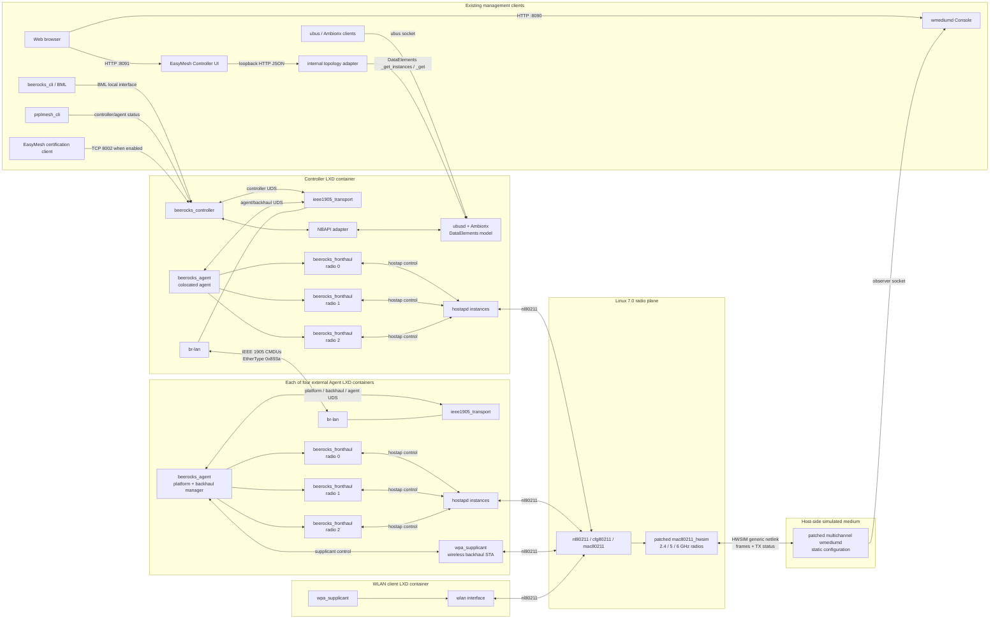

# prplMesh software architecture

This document describes the prplMesh 6.0.0 native Linux software used by this
experiment and the internal read-only topology adapter layered over NBAPI.

## Complete process and protocol view



The three per-agent fronthaul processes map to `wlan0`/2.4 GHz,
`wlan2`/5 GHz and `wlan4`/6 GHz in this native Linux profile.

## Controller stack

### `beerocks_controller`

This is the EasyMesh controller. It maintains the live network model of
agents, radios, BSSs, stations, topology relationships, metrics, policies, and
steering state. It consumes and emits EasyMesh CMDUs through the IEEE 1905
transport rather than opening a raw Layer-2 socket itself.

Its topology model is primarily in memory. The native experiment does not use
MariaDB. After restart, agents and clients must be relearned from protocol
exchange. BML and NBAPI are projections or management interfaces to this model,
not independent topology authorities.

### `ieee1905_transport`

This is the shared IEEE 1905.1 transport and message broker. It:

- sends and receives IEEE 1905/EasyMesh CMDUs on `br-lan`;
- owns `/tmp/beerocks/uds_broker`;
- distributes CMDUs to the controller and colocated agent over Unix-domain
  sockets;
- handles message identifiers, fragmentation/reassembly, relay behavior, and
  Layer-2 transport details.

The live controller currently exposes these internal sockets:

```text
/tmp/beerocks/uds_broker       ieee1905_transport
/tmp/beerocks/uds_controller   beerocks_controller
/tmp/beerocks/uds_platform     beerocks_agent platform interface
/tmp/beerocks/uds_backhaul     beerocks_agent backhaul manager
/tmp/beerocks/uds_agent        beerocks_agent main interface
```

### Colocated `beerocks_agent`

The controller container normally also runs an agent, matching a gateway that
is both EasyMesh Controller and Agent. The agent owns the local radio/platform
state, starts per-radio fronthaul workers, and represents the gateway radios to
the controller through normal EasyMesh exchanges.

### `beerocks_fronthaul`

One process runs per active radio, for example:

```text
beerocks_fronthaul -i wlan0
beerocks_fronthaul -i wlan2
```

It contains the AP manager and monitor paths for that radio. Through the BWL
NL80211 backend it controls and observes hostapd, reports radio/BSS/STA events,
and executes controller requests such as BSS configuration, channel changes,
measurements, and association control.

## Separate agent stack

The separate agent runs the same `ieee1905_transport`, `beerocks_agent`, and
per-radio `beerocks_fronthaul` processes but does not run
`beerocks_controller`.

Its responsibilities include:

- discovery and AP autoconfiguration search;
- WSC M1/M2 onboarding and credential application;
- topology discovery and response;
- radio, BSS, AP, STA, and link metrics reporting;
- execution of policy, channel, association-control, and steering requests;
- wired or wireless backhaul selection and maintenance;
- local hostapd and wpa_supplicant coordination.

For wireless multihop, the agent's backhaul manager controls a
wpa_supplicant-based backhaul STA while its fronthaul workers retain the AP
BSSs. The backhaul interface is joined into or connected with `br-lan`, so
IEEE 1905 traffic reaches the upstream agent over the selected wireless link.

## Platform and radio abstraction

### BPL — Beerocks Platform Library

BPL provides platform configuration and lifecycle integration: management
mode, bridge and interface names, credentials, persistent settings, and
platform-specific operations. The generated `prplmesh_platform_db` is platform
configuration; it is not the learned topology database.

### BWL — Beerocks Wireless Library

BWL is the radio/driver abstraction. This experiment builds two variants:

- `DUMMY`, used only to prove controller-agent control-plane onboarding;
- `NL80211`, used for acceptance with hostapd, wpa_supplicant, hwsim and
  wmediumd.

The NL80211 BWL communicates through:

- hostapd control sockets such as `/var/run/hostapd/wlan0`;
- wpa_supplicant control sockets for backhaul STA interfaces;
- nl80211 generic netlink for kernel radio configuration and events.

### hostapd and wpa_supplicant

hostapd owns AP authentication, association, encryption, beaconing, and client
state on each fronthaul/backhaul BSS. wpa_supplicant owns WLAN station behavior
for an agent's wireless backhaul and for standalone test clients. prplMesh
orchestrates these daemons; it does not replace their 802.11 state machines.

## Northbound and diagnostic interfaces

### BML

The Beerocks Management Layer supplies the existing controller CLI and test
interface. BML commands configure credentials and expose management actions.
At the full wireless-backhaul/client scale, `beerocks_cli -c bml_conn_map` can
wait indefinitely for its asynchronous callback, so it is not used as an
acceptance state API. Bounded NBAPI instance queries are the authoritative
test interface.

### NBAPI and Ambiorix/ubus

The NBAPI adapter maps the controller model to the standardized
`Device.WiFi.DataElements` hierarchy. Ambiorix supplies the data-model runtime;
`ubusd`, libubox, the Ambiorix libraries, the ubus adaptor, and `mod-dmext`
provide the local northbound bus and model extensions.

The principal socket is:

```text
/var/run/ubus/ubus.sock
```

NBAPI is not an optimizer and is not a second topology database. It is a
structured management representation of controller state and supported
actions. The tested steering action is the per-STA
`MultiAPSTA.BTMRequest`; it produces an EasyMesh Client Steering Request,
hostapd `BSS_TM_REQ`, station response, and controller-model update.

### Internal topology adapter and Controller UI

`topology-adapter/server.py` is a separate process, not controller code. It runs in
the controller container because ubus is a local Unix-domain interface. It
uses only `_get_instances` and `_get`, normalizes Device/Radio/BSS/STA objects
to `/api/topology`. A loopback-only TCP forwarder makes that JSON available to
the separate Controller UI on port 8091. The adapter has no public page and is
not exposed outside the appliance. This keeps Web concerns out of prplMesh
while the Controller UI can share the RDK topology presentation.

Dynamic instances must be discovered through the DataElements
`_get_instances` method. `ubus list` describes registered object endpoints but
is not a reliable inventory of moved STA instances.

### prplMesh CLI and UCC

`prplmesh_cli` reports controller/agent operational state. The certification
listener is available on TCP port 8002 when enabled and is intended for
EasyMesh test/control flows, not as a production Web API.

## Shared libraries and dependencies

The build installs these main prplMesh libraries:

| Library | Purpose |
|---|---|
| `libtlvf`, `libbtlvf` | generated IEEE 1905/EasyMesh TLV and CMDU encoding |
| `libbcl` | common sockets, event loop, logging, utilities and work queues |
| `libbtl` | transport-facing common functionality |
| `libbpl` | platform abstraction and configuration |
| `libbwl` | DUMMY or NL80211 wireless abstraction |
| `libbml` | northbound/controller management client interface |
| `libnbapi` | controller-model to Ambiorix DataElements adapter |
| `libieee1905_transport_lib` | IEEE 1905 transport implementation |
| `libmapfcommon` | message and platform framework utilities |
| `libprplmesh_hostapd` | hostapd control integration |
| `libmulti_vendor` | vendor-specific EasyMesh extension handling |
| `libelpp` | process logging support |

External native dependencies include libnl, OpenSSL, json-c, libubox/ubus,
Ambiorix libraries and ubus adaptor, `mod-dmext`, hostapd and wpa_supplicant.

## Virtual-radio boundary

The kernel owns cfg80211/mac80211 state and the simulated radios. The patched
Linux 7.0 hwsim module permits wmediumd registration across simultaneous
channel contexts and uses the 6 GHz-capable `regtest=5` regulatory profile.

wmediumd receives 802.11 frames from hwsim over generic netlink, schedules and
delivers them within their frequency context, applies the configured SNR/PER
model, and returns transmit status. The normal prplMesh profile uses a complete
static 40-radio roster. The RCPI acceptance test replaces only the global SNR
configuration and restarts wmediumd, proving that all telemetry follows the
medium without restarting containers. Dynamic scenario-control and observer
sockets remain future shared-lab integration work.

This boundary is deliberately below prplMesh: the controller and agent see
normal hostapd, wpa_supplicant and NL80211 behavior and should not need to know
that their radios are virtual.
