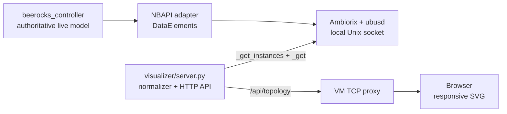

# prplMesh topology visualizer

The visualizer is a separate read-only application over the existing
`Device.WiFi.DataElements` NBAPI model. It does not scrape prplMesh logs, use
BML text output as an API, maintain a second topology database, or alter
controller state.



The normalized API contains EasyMesh devices, their backhaul parent and type,
radios, band/opclass/channel, BSSs, and attached clients. STA instances are
discovered with `_get_instances`; `ubus list` is not used as a topology
inventory. The browser refreshes every two seconds and has no external
JavaScript dependency. Backhaul STAs are represented by the device-parent edge
and are not counted or mislabeled as ordinary WLAN clients.

Start and check it inside the radio VM:

```sh
/path/to/prplmesh-lab/scripts/topology-visualizer.sh start
/path/to/prplmesh-lab/scripts/topology-visualizer.sh status
curl http://127.0.0.1:8090/api/topology
```

The start command prints the VM address. The backend runs inside the controller
container to use the local ubus socket; the VM proxy only forwards TCP and does
not interpret model data. The host proxy exposes the page at
`http://HOST-IP:8090/`.

The current UI is diagnostic. It intentionally has no steering controls until
the read-only model and multihop representation are accepted. A later control
surface should invoke the same NBAPI actions used by the acceptance tests and
must display transaction result separately from observed reassociation.
