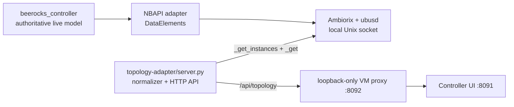

# Internal prplMesh topology adapter

[Subsystem index](README.md)

The adapter is a separate read-only process over the existing
`Device.WiFi.DataElements` NBAPI model. It does not scrape prplMesh logs, use
BML text output as an API, maintain a second topology database, or alter
controller state.



The normalized API contains EasyMesh devices, their backhaul parent and type,
radios, band/opclass/channel, BSSs, and attached clients. Device instances are
discovered with `_get_instances`; `ubus list` is not used as a topology
inventory. Device/radio/BSS metadata is read concurrently at depth four.
Client membership then comes from **one** `_get` of
`Device.*.Radio.*.BSS.*.STA.` at depth one, rather than merging STA lists from
different device-read times. This prevents a roam from appearing at both its
old and new AP. No timestamp-based deduplication, guessed owner or cached
roster is substituted. Keeping membership separate also avoids an oversized
full-network recursive reply. Backhaul STAs are represented by the device-parent edge
and are not counted or mislabeled as ordinary WLAN clients.

The pinned ubus library also needs the lab's reentrant-dispatch backport;
normal builds and node startup include it. See
[dependency qualification](../testing/room-acceptance.md#prpl-libubus-reentrancy).
A dead native controller produces an unavailable topology, not a cached success.

Start and check it inside the radio VM:

```sh
/path/to/prplmesh-lab/scripts/topology-adapter.sh start
/path/to/prplmesh-lab/scripts/topology-adapter.sh status
curl http://127.0.0.1:8092/api/topology
```

The backend runs inside the controller container to use the local ubus socket.
The VM proxy listens only on `127.0.0.1:8092`; it is an implementation detail
of the Controller UI and is not exposed through the outer LXD VM. The obsolete
standalone topology page was removed so operators see one topology UI with the
same behavior and appearance as the RDK lab.
