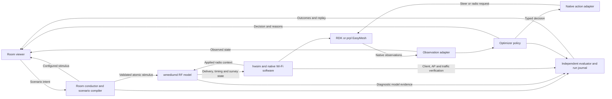

# EasyMesh RF laboratory: assessment and prioritized development plan

Date: 14 September 2026  
Status: Proposed development plan; no implementation or lab changes made  
Audience: RF lab, RDK, prplMesh, optimizer and room-viewer developers

## 1. Objective and assessment

The objective is to give an optimizer developer a rich, controllable RF environment in which real Wi-Fi clients, AP software and EasyMesh implementations respond to changing conditions. The developer must be able to create an experiment, inspect the observations available to a policy, run competing policies, and explain their effects on connectivity and service.

**The current system is a useful signal-steering laboratory with a growing load model. It does not yet cover the majority of optimizer-relevant RF effects with qualified behavior.** Its largest remaining gaps are independent noise and interference, overlapping spectrum, receiver-local collisions, modern PHY service capacity, and realistic measurement availability.

The investment priority should be the RF and observation model. Android wmediumd offers useful robustness fixes and operational tools, but switching forks would not provide these missing capabilities.

A feature counts as complete only when all four conditions hold:

1. The scenario can control the relevant stimulus through a documented, bounded interface.
2. The stimulus changes packet delivery, timing or native radio state according to a declared model.
3. RDK and prpl expose the resulting observations with correct identity, units, age and availability.
4. The optimizer and viewer can use or explain those observations, and an independent evaluator can verify the result.

A configuration field, advertised capability, injected test value or successful command response does not establish all four conditions.

### Evidence and limits

The source baseline is `boardfarmdevs/meta-cmf-bananapi-vcpe`, branch `codex/0913-clean`, commit `a41216dba48c9fc91dbb37456e207549462d99a9`. The assessment includes the upstream wmediumd base `717e5d7fcc23eecbc8e32bd897a8fd4b1e3ba640` with all 29 branch patches applied in a scratch checkout. Optimizer and room interfaces were checked against that same layer revision. [S1–S7]

Runtime results quoted here are the repository's recorded qualification results; they were not rerun for this document. The separate deployed prpl source tree and current binaries were not independently inventoried in this review. The prpl locations and integration status below follow the shared branch assessment and must be confirmed in M0. Older architecture pages contain historical limitations; current code and the RF assessment's later implementation sections take precedence. [S1]

### Current capability assessment

| Capability | Current position | Useful today | Remaining limitation |
| --- | --- | --- | --- |
| Geometry, walls, movement and presence | Implemented room compiler and live interactions | Repeatable coverage and mobility experiments | Fixed-loss abstraction; no material-aware ray tracing or correlated multipath |
| Directed, frequency-qualified SNR | Implemented atomic updates and readback | Asymmetry, per-band link quality and outages | Received power and noise are not independent physical inputs |
| Loss, retry feedback and reverse ACK | Implemented with legacy rate/PER approximations | Weak-link and asymmetric-link behavior | No calibrated modern-PHY error/service model |
| Native receive-channel context | Implemented paired hwsim/wmediumd protocol | Passive/off-channel reception eligibility | Does not itself supply fresh candidate measurements or complete scan qualification |
| Local channel utilization | Modeled airtime reaches native surveys and both reporting paths | Controlled load experiments under the declared legacy20 profile | Model occupancy is not calibrated real-world capacity |
| Beacon BSS Load | Native survey integration plus explicit fixed-value tests | Field handling and measured-model load reporting | Neighbor-advertised load and locally sensed load are separate observations |
| Spatial reuse | Optional conservative visibility reservations | Isolated unicast links sharing a frequency | Hidden-receiver cases are protected by reservations rather than realistic collisions |
| Independent noise and non-Wi-Fi energy | No supported complete room primitive | Limited fixed-noise SNR experiments | Cannot preserve RSSI while independently increasing background noise |
| Channel width and spectral overlap | Native width configuration exists; medium uses exact-frequency isolation | Configuration and protocol tests | No qualified partial overlap, adjacent-channel rejection or wide-channel service model |
| PHY rate, aggregation and service capacity | Modeled legacy receive-rate metadata and corrected legacy timing | Qualitative service changes within a narrow profile | HT/VHT proxies; no qualified HE/EHT, aggregation, MU or MLO capacity model |
| Power-control feedback | Scenario transmit gain changes SNR | Manual gain/coverage experiments | Native radio power changes are not proven to update the same RF model |
| Candidate measurements | Native query path with explicitly model-derived candidate RCPI | Controlled candidate-ranking experiments | Idealized availability can hide silent, off-channel or undecodable candidates |
| Optimizer | Signal policy, opt-in load policy, replay, journal and bounded steering verifier | Explained steering and scoped load balancing | Activity is not offered demand; backhaul hops are not capacity; width/backhaul planners are recommendation-only |
| Room viewer | Geometry, live native topology, controlled editing, playback and load card | Interactive stimulus and result inspection | Needs receiver-specific RF views, richer measurements, interference relationships and comparative outcomes |

The recorded two-flow tests show approximately twice the aggregate throughput for isolated links relative to global contention on both stacks. This qualifies that behavior of the reservation model; it does not qualify full DCF, hidden-node collisions or physical capacity. [S1, section 12.5]

## 2. Architecture to preserve and extend

Keep one shared RF contract and optimizer core, with platform-specific native adapters. Extend the existing compiler, single RF writer, room conductor, observation model and journal. Retain the current legacy profile and existing rooms as the regression baseline.

The applied-radio-context feedback arrow is partly implemented for frequency/receive context. Complete power, width and other new metadata contracts in the milestones below; the diagram is the target architecture, not a claim of current completeness.

### Responsibilities

| Component | Owns |
| --- | --- |
| Room/scenario tooling | Geometry, neighbor actors, traffic schedules, scenario noise/emissions, seeds and intended environment changes |
| wmediumd | Energy visibility, decoding/PER, channel access, modeled service time, delivery and medium diagnostics |
| hwsim/native Wi-Fi | Radio/VIF lifecycle, active receive contexts, station behavior, native counters and survey delivery |
| RDK/prpl integration | Native measurement production, translation, publication and native command execution |
| Optimizer | Decisions using permitted observations, constraints and policy state |
| Viewer | Inspection, scenario authoring, explicitly requested manual actions and explanation |
| Independent evaluator | Ground-truth comparison, native/client/traffic verification, attribution and qualification |

The live optimizer must not consume room coordinates, configured SNR/noise, hidden transmitters or future scenario events as measurements. Those remain available to the developer and evaluator. Existing explicitly synthetic offline policy simulations remain useful and must remain labeled. [S2–S5]

### Compatibility and control rules

- New RF models are negotiated profiles, enabled explicitly per run. Merely adding fields must not change old room behavior or policy defaults.
- Extend existing socket capabilities and schemas with versioning; do not reinterpret old packets or old SNR fields. Kernel-medium support is negotiated separately from userspace wmediumd.
- Retain one RF writer, revision checks, bounded work and readback. A browser cannot write directly to daemon sockets.
- Record the owner of each action class: client steering, channel/width/power selection and backhaul changes. A native-policy experiment leaves that class to the native implementation; an external-policy experiment explicitly prevents competing automation for that class.
- Manual actions are attributed separately. A request may be submitted, accepted, applied, observed, verified, rejected or timed out; these states are not interchangeable.
- Snapshot all affected settings, identities and model epochs before changes. Restore only against matching ownership/identity; a provider restart requires reconciliation, not blind replay.
- Declared setup operations may require a restart or radio-pool rebuild. Such setup finishes before the measured experiment; do not hide restarts inside a timed policy result.

## 3. Priority, feasibility and dependencies

The order balances developer value, implementation feasibility and prerequisite work. Effort is relative: **S** is a bounded change, **M** spans a few established components, **L** adds substantial state/model behavior, and **XL** requires research or calibration. These are planning sizes, not calendar commitments.

| Order | Milestone | Priority / feasibility | Effort | Dependencies | Developer-visible result |
| --- | --- | --- | --- | --- | --- |
| 0 | M0: Baseline and capability inventory | Essential / high | S | None | Reliable statement of what this exact lab can test |
| 1 | M1: Rich observations and viewer inspection | Highest / high | M | M0 | Inspect the same evidence and reasons used by the policy |
| 2 | M2: Controlled neighbors, traffic and load experiments | Highest / high to medium | M–L | M1 | Run useful nearest-neighbor and congestion rooms with today's medium |
| 3 | M3: Realistic measurement availability | High / medium | M–L | M1; reuse M2 actors | Test discovery, stale data and measurement cost honestly |
| 4 | M4: Independent noise, received power and energy | Highest RF-model value / medium | L | M0–M2 | Distinguish weak coverage, noise and sensed busy time |
| 5 | M5: Occupied spectrum and overlap | High / medium | L | M4 | Experiment with overlapping BSSs and channel-width tradeoffs |
| 6 | M6: Receiver-local collisions and channel access | High / harder | L–XL | M4; same-channel slice can precede M5 | Exercise hidden/exposed nodes and collision-sensitive policies |
| 7 | M7: Qualified PHY service and QoS | High / medium to harder | L–XL | M1–M2; combine with M5–M6 for interference claims | Compare capacity, demand, queues and backhaul bottlenecks |
| 8 | M8: Coordinated RF optimization and native actuation | High / medium to harder | L | Capability-specific M3–M7 gates | Move beyond client steering to qualified radio/backhaul actions |
| 9 | M9: Calibration, scale and release profiles | Essential for transfer claims / variable | L | Qualification runs throughout; final release follows selected profiles | State which results transfer to hardware and at what scale |

M3, M4 and an isolated M7 service-time prototype can proceed independently after their prerequisites. M8 is deliberately incremental: qualify 20 MHz channel requests in M2 and power feedback in M4; do not wait until the end to test every actuator. Autonomous decisions using a new effect require that effect's acceptance gate.

The first useful delivery is **M0–M2**, followed by M3 for realistic observation experiments. It already gives developers comparative load rooms, explained decisions and reproducible records. Completion of those milestones must not be advertised as realistic overlap, collisions or modern-PHY capacity.

## 4. Milestone implementation plan

### M0 — Freeze the baseline and reconcile capability claims

**Common work**

- Record RDK and prpl commits, applied patch-series hashes, daemon/module/HAL identities, active flags and actual native reporting intervals.
- Extend the existing RF capability manifest to distinguish: implemented in code, active in this run, observable through this platform, and qualified for this profile. A capability bit is not a fresh measurement.
- Reconcile older assessment text and conservative capability flags against the recorded tests. Do not mark all implementations qualified merely because code exists.
- Preserve the present signal rooms, native-load experiments, receive-context behavior, reverse ACK outcomes and global/visibility baselines.
- Inventory radio-pool capacity and spare actors before adding neighbors. Existing room roster checks must remain valid.

**Optimizer and viewer**

Expose one run capability report and model profile. Existing policies continue unchanged. The viewer shows unsupported controls as unavailable with a reason and displays the active decision owner.

**Acceptance:** both platforms produce a versioned manifest and baseline report; existing signal/load/room regressions pass; unavailable fields remain distinguishable from zero. No physical-capacity qualification is inferred.

### M1 — Extend observations and make the viewer explain them

**Common and platform work**

- Define the next versioned observation schema as an extension of current snapshots, retaining v1/v2 readers or explicit compatibility adapters.
- Represent radio/channel contexts once; let BSS records reference them. Separate local channel utilization, neighbor-advertised BSS Load and BSS station count.
- Carry direction, observation window, source, measurement time where available, receipt time, context/provider epoch and availability. Unknown measurement time stays unknown.
- Add bounded histories and event correlation to the existing observer/journal flow. Keep daemon diagnostics outside live policy input.

**Optimizer**

Extend immutable types and normalization first. Preserve the current default signal policy and opt-in load policy. Expose excluded candidates and explicit no-action reasons. New metrics enter policy only after source/age/identity checks; schema support alone must not enable a new scoring rule.

**Viewer**

Add selectable views for configured stimulus, native observations and optimizer decisions. Build a radio/BSS/client/link inspector, a synchronized timeline and a run-comparison view. Retain existing signal colors in the signal view; introduce the separate channel/load view described in section 6.

**Acceptance:** replay the same observation journal through both the policy and viewer; selected values and decision evidence match. Tests cover valid zero, missing/stale data, shared-radio BSSs, provider restart and contradictory identities. Static mode makes no live control requests.

### M2 — Add controlled neighboring networks and useful traffic rooms

**Common work**

- Add independently identified foreign AP/BSS actors and bounded associated traffic endpoints. Foreign neighbors must not appear as managed EasyMesh Agents or eligible steering targets.
- Provision actors from a declared pool at setup. Expand the pool only in a separate prepared lab profile; never reload hwsim to change a room during a run.
- Define two explicit experiment types: fixed advertised-load fixtures for field tests, and actual traffic-driven load for medium/policy tests. Control them independently.
- Extend current traffic profiles into repeatable live actors: uplink/downlink, UDP/TCP, packet size, rate, duration, bursts and destination. Track requested, generated and delivered traffic separately.
- Build rooms for: near busy neighbor, distant busy neighbor, several visible neighbors, one high-demand client, slow-client contention and wireless-backhaul load.
- Start with exact-frequency, legacy20 conditions. Local visibility experiments use the declared optional profile; overlap experiments remain blocked until M5.
- Add bounded capture around selected events, using existing capture facilities first. Any runtime-capture extension needs size/duration/error/overhead controls.

**RDK and prpl**

Verify beacon/scan/report identity and BSS Load end to end, including absent values. Confirm that native surveys react to actual modeled traffic. Exercise one supported 20 MHz channel change through each native path, with new-context warm-up and exact readback/restoration; preserve active backhaul.

**Optimizer**

Extend the current guarded load experiment without equating packet activity to offered demand. Use native observed activity/goodput where available; actor demand is evaluator truth unless the experiment explicitly provides application demand as a production-plausible input. Continue one-client action batches, viable-target checks, hold, settling and cooldown.

**Viewer**

Provide neighbor creation/configuration through server-owned scenario edits, traffic controls, advertised-versus-local-load inspection and the nearest-neighbor graph. Preview changes, then show the committed revision and subsequent native observations. A top-N display filter must not remove actors from the simulation.

**Acceptance:** a fixed BSS Load fixture can change advertised load without being mistaken for measured congestion; actual traffic changes modeled local load and native reports; a weakly visible busy neighbor is distinguishable from a strongly visible one under the appropriate profile. Both stacks complete scoped steering and restoration with independent traffic evidence.

### M3 — Make measurement availability and scan cost realistic

**Common work**

- Retain explicit idealized candidate mode for deterministic algorithm tests.
- Add reception-backed samples keyed by observer, subject, direction, frequency/context, time and source. Use actual decoded frames or native measurement results; do not refresh a sample by reading a matrix.
- Distinguish AP-beacon signal measured by a scanning station from station signal measured by an AP. Reciprocity is a declared approximation, not an automatic conversion.
- Integrate existing passive/active scan machinery with dwell, channel eligibility, validity windows and measurement-request budgets. A silent or off-channel entity may have no sample.
- Record scan disruption and delayed/incomplete results; preserve native protocol behavior instead of inventing immediate answers.

**Optimizer**

Add measurement scheduling as a separate budgeted component. Policies can request more evidence or abstain. Keep idealized and reception-backed experiments separately labeled and scored; retain exact target-BSSID and capability gates.

**Viewer**

Show observer selection, scan timeline, last-heard age, incomplete coverage and reason for missing candidates. A geometry-predicted link remains a model overlay, not proof that it was measured.

**Acceptance:** silent/off-channel/undecodable candidates do not acquire fresh samples; successful relevant reception does; retunes invalidate the old context; measurement budgets and service disruption are recorded. RDK and prpl preserve the distinction through native reporting.

### M4 — Separate received power, noise, sensing and decoding

**Common work**

- Introduce a new RF profile with directed received power, receiver noise, frequency/width context and separate sensing/decoding parameters. Preserve the legacy SNR profile unchanged.
- Calculate noise/interference sums in linear power units. Define receiver bandwidth and thermal/reference assumptions explicitly; an RSSI or dBm sum is invalid.
- Add bounded continuous and bursty energy actors with location/visibility and spectrum metadata. Begin with controlled abstractions, labeled as such.
- Make actual applied transmit power feed the same link model. Define composition so scenario gains and native power deltas are not counted twice.
- Publish only supported survey/noise observations with their provenance. Trace exports remain diagnostics unless routed through an explicitly supported native measurement.

**Optimizer**

Add capability-gated noise/SINR evidence and diagnosis reasons. Keep missing noise unknown. A policy should distinguish weak coverage from a strong-but-impaired link before selecting an intervention; initially run these decisions in recommendation mode.

**Viewer**

Add independent received-power/noise controls, noise-source burst scheduling, sensing-versus-decoding overlays and aligned RSSI/SINR/retry/goodput plots. Show modeled and native readings separately.

**Acceptance:** raise noise at fixed received power and verify unchanged model RSSI, reduced SINR and changed loss/service; verify additive-power arithmetic; confirm radio-specific effects and native power feedback. RF losses, delivery/injection failures and host overload remain distinct.

### M5 — Model occupied spectrum and channel overlap

**Common work**

- Represent primary/control frequency, center frequency or centers, and occupied width explicitly. Replace exact-frequency isolation only in the new profile.
- Start with bounded 20/40/80 MHz cases. Add 160 MHz, puncturing and more complex operation only with separate support and tests.
- Define a documented spectral-overlap/rejection model that weights received interfering energy. Use a simple calibrated coefficient model first; do not imply ideal notch filtering or precise hardware filters.
- Include width in receiver context and observation identity. Define stale-context and override reclamation behavior during retunes.
- Keep channel overlap and PHY service rate as separate capabilities: a wider spectrum model does not automatically provide a wider-channel capacity model.

**Optimizer**

Extend channel observations and the existing recommendation-only width planner with supported overlap evidence. Hard-gate unsupported widths and unavailable/regulatory channels. Do not score a nominal 80 MHz channel as four times a 20 MHz service rate without M7 evidence.

**Viewer**

Add a spectral strip showing occupied ranges, primary channels and overlaps. A width/channel preview shows predicted overlap changes; any predicted throughput remains unavailable until its service model is qualified.

**Acceptance:** controlled overlapping channels affect the intended receivers; nonoverlapping/rejected energy follows the declared profile; bandwidth and noise assumptions stay consistent; both platforms report the new applied context accurately.

### M6 — Add receiver-local collision and channel-access behavior

**Common work**

- First add an experimental same-channel event model: transmission start/end, desired signal, simultaneous interfering energy and per-receiver decoding outcome.
- Then add channel-access behavior with declared CCA, backoff/freeze/resume and applicable NAV/RTS/CTS scope. Maintain forward-data and reverse-ACK outcomes independently.
- Allow hidden transmitters to overlap where the sender cannot sense its competitor. Evaluate damage at the receiver instead of globally preventing the overlap.
- Separate energy occupancy, waiting time, decoding failure, retries and reservation delay in diagnostics. Preserve union accounting for utilization.
- Bound active events and receiver relationships. Reject or mark overloaded experiments invalid rather than silently dropping interference contributions.

**Optimizer**

Use measured retries, load and service evidence to evaluate collision-sensitive policies. A diagnostic engine may identify a hidden-node condition; the optimizer sees that label only if it is an explicit, observation-derived production feature. Compare abstention, client steering and channel recommendations before enabling new actions.

**Viewer**

Add observer-specific sensing/decoding relationships, overlapping transmission intervals and collision outcomes. Mark modeled relationships as modeled; an AP-to-AP interference edge requires supporting observations or an explicit model view.

**Acceptance:** isolated links reuse airtime; visible contenders defer; a hidden interferer can degrade the receiver while the sender senses a clear medium; reverse ACK impairment behaves independently. Compare controlled timing traces with the specified model and later hardware references. Keep the existing reservation profile available.

### M7 — Qualify PHY service, demand and QoS

**Common work**

- Define a supported PHY subset and audit whether hwsim supplies the required rate/MCS, width, GI, NSS and aggregation metadata. Extend the interface where necessary; explicitly report unsupported combinations.
- Implement tested service-time and PER functions separately. Preserve native rate-control feedback; do not force a high RX rate or accelerate the scheduler clock to improve apparent throughput.
- Introduce declared aggregation assumptions and validate their relationship to actual hwsim frame/status behavior. Existing singleton aggregate feedback is not an aggregation model.
- Add bounded per-access-category queues, service/wait diagnostics and selected TXOP behavior. Defer complete MU/OFDMA scheduling until a separate model is justified.
- Measure application goodput, retry/failure deltas, queue delay and end-to-end latency under controlled offered load. Model shared wireless-backhaul airtime across hops.

**Optimizer**

Add an optional demand/capacity estimator with confidence and provenance. Compare expected service improvement against disruption cost. Preserve conservative rules when demand or backhaul capacity is unknown; do not substitute client count, packet count, nominal PHY rate or `100 - utilization` for capacity.

**Viewer**

Display PHY profile, rates, service time, queue delay, traffic demand and achieved goodput as distinct quantities. Show fronthaul and backhaul bottlenecks, with bounds/uncertainty for estimates.

**Acceptance:** known-rate fixtures match documented service times; slow clients consume the expected airtime; width/MCS/aggregation changes produce explainable outcomes; shared backhaul limits end-to-end service. No physical-capacity claim precedes calibration.

### M8 — Enable coordinated RF policies and verified native actions

**Common and platform work**

- Build typed native action adapters for the individually qualified subset of channel, width, power and backhaul requests. Extend the existing steering transaction pattern.
- Preflight capabilities, client eligibility, current regulatory/channel constraints, backhaul continuity and model support. Snapshot all affected radio settings, including unrelated contexts that a platform-wide apply might touch.
- Observe actual native application, new context/measurement warm-up and service convergence before closing an action. Implement bounded rollback/reconciliation and failure attribution.
- Validate each platform's enabled native policy behavior. Native-policy runs must remain available; an external policy must not compete silently for the same action class.

**Optimizer**

- Extend the existing pure policy interface and recommendation-only planners; keep I/O in adapters.
- Progress from recommend-only, to one bounded action, to coordinated policies. Freeze the RF profile while comparing algorithms.
- Use explicit objectives: service continuity, useful goodput, tail latency, fairness and disruption cost. Explain constraints and expected benefit; retain hold/dwell/cooldown and action budgets.
- Record rejected alternatives and before/after observations. Distinguish an invalid model/measurement experiment from an unsuccessful but valid policy decision.

**Viewer**

Show proposal, evidence, requested action, native application and verified outcome on one timeline. Allow manual actions only through the room's authority/transaction mechanism. Provide A/B policy replay and result comparison without replacing native associations with predicted best links.

**Acceptance:** every enabled action succeeds or fails observably on both stacks, with exact state/traffic verification and restoration. Client rejection, missing telemetry, provider restart and backhaul disruption have bounded, tested outcomes. Unsupported actions remain recommendation-only or unavailable.

### M9 — Calibrate, scale and publish supported profiles

Qualification is part of every milestone. This milestone consolidates it into release claims.

- Compare selected signal, noise, overlap, collision and service cases against controlled hardware measurements. Record equipment, widths/rates, traffic, sample windows and tolerance bands; avoid fitting and validating against only the same traces.
- Provide regression suites at declared actor/client counts. Include UI/observer enabled and disabled runs to measure overhead.
- Scale from a small fully understood topology. Add sparse active-link evaluation, bounded history and display filtering before claiming hundreds of active RF actors.
- Publish profile-specific support and known limits. Track directional correctness, repeatability and physical calibration separately.
- Keep packet-model randomness seeded and independent of observer reads. Real OS scheduling, TCP and native timing remain variable; live experiments require repeated trials, not claims of bit-identical replay.

**Acceptance:** each released profile has an evidence bundle, capacity limit, reproducible setup, compatibility manifest and rollback. The viewer exposes that profile and its limits. Unsupported modern features remain explicitly outside the result claims.

## 5. Optimizer data and interaction contract

### Observation groups to add incrementally

| Group | Required identity | Values and semantics |
| --- | --- | --- |
| Radio/channel observation | Device, radio, frequency/width context and epoch | Local utilization; noise only when supported; channel state; measurement window |
| BSS observation | BSSID and owning radio context | Station count; received advertised BSS Load and its source; managed/foreign status |
| Directed link observation | Observer, subject, direction, channel context | RSSI/RCPI, supported SNR/SINR, attempts/retries/failures, sample count and age |
| Client service | STA, serving BSSID, direction and interval | Native bytes/packets, goodput, supported delay/queue metrics; inferred demand separately labeled |
| Backhaul service | Link endpoints, band/context and path | Observed service/load and shared-airtime relationships; unknown capacity stays unknown |
| Candidate evidence | STA, exact candidate BSSID, capability and channel | Measurement source, request/result correlation, eligibility and freshness |
| Action/result | Run, decision and operation IDs | Preconditions, request, native response, observed application, verification and recovery |

Each metric needs value/unit, availability, source, time semantics, observation window and context identity. Keep provider boot/epoch identifiers local to their source; do not compare different providers' epochs as though they were one clock. Normalize monotonic timestamps only within a known clock domain and retain native time/receipt uncertainty.

Use `unknown`, `unsupported`, `stale`, `warming_up` and `invalid` states rather than plausible numeric defaults. Local utilization percentages and BSS Load bytes require explicit conversion; RSSI/SNR, received power/noise, attempts/packets, demand/goodput and PHY rate/service capacity remain separate.

### Decision flow

1. Validate capability, topology, identity, freshness and time-window compatibility.
2. Identify eligible targets and applicable constraints.
3. Assess the service problem from available evidence; request measurements or abstain if necessary.
4. Compare supported actions and expected benefit, with uncertainty and disruption cost.
5. Apply persistence, action-budget and cooldown rules.
6. Issue a typed native request only in the selected act mode.
7. Verify association/radio state and actual service independently; update policy state and journal.

Expose policy extensions through the existing immutable snapshot/pure decision interface. Provide plain-JSON evaluation, recorded-input replay and synthetic offline tests. A saved observation trace supports decision replay; it cannot prove the network outcome of a different policy because different actions change future observations. Outcome comparisons require separate live/emulated runs or an explicitly synthetic closed-loop simulator.

## 6. Room-viewer design for RF interaction

### Required views

| View | Purpose and interaction |
| --- | --- |
| Room and topology | Preserve positions, walls, movement and native associations; add managed/foreign actors and explicit backhaul state |
| Nearest neighbors | Select an observer; inspect visible BSSs, channel groups, load and directed relationships |
| Spectrum | Compare occupied bandwidth, primary channels, overlap, energy sources and supported radio alternatives |
| Inspector | Select radio, BSS, client, link or energy source; show configured, observed and derived quantities with units/source/age |
| Timeline | Align scenario revision, traffic changes, scans, observations, decisions, native actions and verified effects |
| Policy comparison | Compare fixed scenarios/seeds across policies using goodput, latency, disruption, fairness, uncertainty and no-action reasons |

### Nearest-neighbor visual encoding

Use the original diagram's concept in a dedicated RF-neighbor view:

- **Hue:** channel or occupied channel group. Preserve the existing signal-color view as a separate mode.
- **Luminance:** advertised channel utilization in the neighbor view; label that choice explicitly. A local-load view uses the selected observer's local measurement instead. Include numeric values and a legend; unknown load uses a distinct pattern.
- **Node area:** a versioned relative contention/risk index based on received power, advertised activity and supported spectral overlap. The index is a visualization/diagnostic heuristic until calibrated; it is not dBm, airtime or physical interference power. Show its factors and missing-data treatment.
- **Edge thickness:** the declared directed relationship weight. Use arrows where direction matters. Distinguish modeled, observed and inferred relationships with labels/styles.
- **Spectral overlap:** visible in the spectrum panel and included in an index only when supported. Do not assume different colors or notional notch filtering imply zero interference.

An observer's beacon capture supports neighbor-to-observer evidence. It does not establish every AP-to-AP edge, location or reciprocal signal. BSSs sharing one physical radio must not be counted as independent airtime sources; when physical-radio identity is unknown, retain that uncertainty rather than silently merging by SSID or vendor.

Top-N filtering is a display feature. Preserve the total population, omitted count and available aggregate statistics, and keep all configured actors in the experiment. Do not rank channels from only the five displayed nodes while presenting the result as a full environmental assessment.

### Editing and playback behavior

1. The developer selects an actor/property and previews a proposed scenario change.
2. The server validates model capability, bounds, active authority and expected revision.
3. The single writer applies the change and publishes the committed revision or an explicit failure.
4. The viewer shows configured state immediately as configured, then separately shows arriving native observations.
5. Decisions and outcomes appear only when produced by their owning processes.

Add controls as their milestones qualify: traffic and advertised-load fixtures in M2; measurement requests in M3; noise/power in M4; spectrum in M5; collision inspection in M6; PHY/service profiles in M7; typed policy/native actions in M8.

Playback pauses scenario time and scheduled stimulus changes according to the existing conductor contract; it must not imply that native reporting or an external radio has paused. Display scenario time, measurement time and wall-clock elapsed time distinctly. Browser rendering never drives RF timing.

Static/GitHub Pages mode remains a disconnected preview/replay interface. It can load exported scenarios and journals but cannot perform live lab actions without a separately configured backend. Exported scenario documents are replayable intentions; full outcome records include the observations and evidence needed to interpret what actually happened.

### PCAP-derived scenarios

Treat captures as measured input with a limited viewpoint. Import BSSID/SSID, frequency/width evidence, received signal, timestamps and BSS Load when present. Record capture interface, dwell/coverage and absent fields. Preserve multiple observations over time.

A capture does not reveal every transmitter, actual traffic demand, physical position or how much neighbor-reported occupancy reaches another room. Scenario authoring must declare assumptions for those quantities. Imported advertised load may initialize a field fixture; creating real traffic to approximate it is a separate calibrated experiment.

## 7. Common work and platform-specific integration

RDK and prpl should share scenario semantics, packet-model behavior, metric contracts, optimizer policy, viewer semantics and acceptance cases. Translate native interfaces at the boundary; do not create two competing definitions of utilization or two independent physical models.

| Area | RDK tasks | prpl tasks |
| --- | --- | --- |
| Radio identity/context | Preserve multiple logical bands/VIFs on the shared hwsim PHY; bind RUID/BSSID to exact contexts | Preserve radio-per-band identity and native broker/NBAPI mappings across all Agents |
| Survey/noise | Extend the existing Banana Pi HAL survey conversion only for supported fields; verify time units and active-context checks | Extend nl80211/BWL survey use; replace noise placeholders only when a valid source exists |
| BSS and AP load | Preserve hostapd → OneWifi → EasyMesh paths, periodic timing and context identity | Preserve hostapd/monitor/Agent → native broker → controller paths, including colocated Agent reports |
| Candidates | Keep matrix-derived mode explicit; integrate actual reception/beacon/scan results and transaction correlation | Preserve candidate socket identity and native result timestamps; integrate reception-backed evidence without refreshing cached time |
| Rate/counter/service fields | Audit HAL/OneWifi parsing, units, counter widths and report availability | Audit BWL/monitor rates/counters and no-op/placeholder ESP paths; expose only qualified sources |
| Native actions | Qualify per-radio changes and operating-channel reports; prevent global ApplyRadioSettings from applying stale unrelated settings | Qualify native radio/scan/channel requests and NBAPI convergence; verify all affected Agent contexts |
| Reporting latency | Use observed RDK cadence and skew limits; do not force shorter cadence to make tests pass | Use observed prpl publication/clock semantics; retain coarse timestamp uncertainty where present |
| Packaging | Keep daemon/module/HAL ABI and patch-series hashes reproducible | Port semantic changes to prpl packaging, confirm its pin and run the same contract tests |

### Implementation map

These are existing extension points, not instructions to edit every file. RDK paths were inspected or enumerated at the pinned revision; prpl paths are the shared assessment's mapping and require M0 confirmation. [S1–S7]

| Workstream | RDK location | prpl counterpart |
| --- | --- | --- |
| Medium | `gen/wmediumd/patches/`, assembled `wmediumd.c`, `control.c`, `airtime.c`, `per.c` | `patches/wmediumd/`, assembled equivalent |
| Kernel/context/survey | `gen/hwsim/patches/` | `patches/hwsim/` |
| Scenario and RF contracts | `gen/wmediumd/configurator/wmdcfg/`: `geometry.py`, `world.py`, `compiler.py`, `actuator.py`, `runner.py`, `rf_contract.py`, `survey_bridge.py` | `wmediumd/configurator/wmdcfg/` |
| Optimizer schema/policy | `gen/optimizer/optimizer/`: `model.py`, `observer.py`, `load_observer.py`, `load_policy.py`, `candidates.py`, `planners.py` | `optimizer/optimizer/` |
| Actions and evidence | Same package: `actuator.py`, `verifier.py`, `recorder.py`, `experiments.py`, `traffic.py` | Equivalent optimizer package |
| Room orchestration | `gen/demo/room_demo/`: `server.py`, `conductor.py`, `engine.py`, `interactions.py`, `journal.py`, `events.py` | `demo/room_demo/` |
| Browser | `gen/wmediumd/configurator/worlds/viewer/`: `index.html`, `interaction-model.js`, `rf-load.js`, `signal-meter.js` | Confirm corresponding deployed viewer source |
| Native integration | `recipes-ccsp/hal/`, OneWifi and unified-wifi-mesh recipes | `patches/prplmesh/`, `scripts/container/`, `manifests/`, `topology-adapter/server.py` |

Keep model functions testable outside transport/event-loop code. Extend structured observation and interaction modules rather than placing physical calculations or policy logic inside browser event handlers.

## 8. Acceptance matrix and evidence

| Case | Earliest milestone | Required behavior |
| --- | --- | --- |
| Existing signal room | Every milestone | Same qualified baseline behavior, native associations and restoration |
| Unknown versus idle | M1 | Missing/stale observations never become zero load or fresh candidates |
| Busy-neighbor field fixture | M2 | Advertised load changes independently of actual traffic; source is explicit |
| Actual nearby contention | M2 | Traffic changes modeled occupancy, native reports and service in the declared profile |
| Distant busy neighbor | M2 visibility profile | High advertised load can coexist with little local sensed activity |
| Silent/off-channel candidate | M3 | No false fresh reception-backed sample; scanning can later obtain valid evidence |
| Noise at constant received power | M4 | RSSI and noise vary independently; SINR/error/service respond consistently |
| Native power change | M4 | Applied power updates affected links once; unrelated contexts remain correct |
| Partial spectral overlap | M5 | Effects depend on occupied spectrum and declared rejection model |
| Hidden transmitter | M6 | Receiver collision loss can rise while desired-sender CCA remains clear |
| Isolated concurrent links | M6 | Airtime reuse without artificial global serialization |
| Slow client / aggregation | M7 | Declared PHY service changes airtime, queues and achieved goodput |
| Wireless backhaul bottleneck | M7–M8 | End-to-end service reflects shared-hop load; steering does not assume hop count equals capacity |
| Radio action rejection / client BTM rejection | M8 | Bounded, explained failure; no fabricated success or forced association |
| Restart, stale context, slow observer, journal overflow | Every affected milestone | Explicit invalidity/recovery; RF processing and ownership remain controlled |
| Higher actor count | M9 | Defined headroom, overhead, sample coverage and UI bounds; overloaded runs are inconclusive |

For each applicable case retain scenario/profile/seed hashes, source and binary identities, committed revisions, native raw records, normalized snapshots, policy configuration, decision/action IDs, client/AP state, traffic measurements, resource/headroom observations and restore verification. Bound capture and journal sizes and report incomplete evidence.

Every model milestone needs independent analytical fixtures before live-stack acceptance. Choose tolerances and repeated-run criteria before examining comparative results. Freeze policy settings while comparing RF implementations, and freeze RF profiles while comparing policies.

RDK/prpl parity means equivalent declared stimulus and contracts with independently verified native results. It does not require identical report cadence, identical roaming decisions or identical timing.

## 9. Deferred work and stop/go decisions

Defer full ray tracing, antenna/beamforming detail, MIMO channel matrices, MU/OFDMA scheduling, full MLO capacity, radar/AFC physics and FTM positioning until a specific optimizer use case requires them. Native protocol/configuration tests can exist earlier under explicit limits.

Use Android's MAC-registration and legacy-API fixes as targeted robustness candidates where their cases reproduce. Add bounded runtime capture when M2 needs it. Do not port its hardcoded RX-rate/scheduler acceleration as an RF-fidelity improvement. FTM and an additional gRPC interface have lower priority for this objective. [S8]

At the M6/M7 design gates, compare the cost of extending wmediumd with a separately qualified discrete-event RF backend if hidden-node/modern-PHY behavior becomes too complex. Preserve the room, observation and optimizer contracts so a backend experiment is possible. A different backend still has to integrate real hwsim/native software and pass timing/measurement tests; substitution is not automatically easier or more faithful.

Release decisions:

- **After M0–M2:** ship a richer controlled-load development environment with precise model limits.
- **After M3–M6:** ship interference/discovery profiles only for their accepted scenarios.
- **After M7–M9:** make capacity and hardware-transfer claims only for calibrated, bounded profiles.

The measure of success is the range of RF causes, observations and corrective actions that can be tested consistently across both platforms, together with known limits. Counting exposed fields or visually impressive rooms is insufficient.

## 10. First implementation backlog

The following are the first proposed changes for a future development branch. None are implemented by this document.

- [ ] M0: Capture both live manifests and map implementation/activation/qualification separately.
- [ ] M0: Preserve baseline signal, native-load, receive-context and spatial-reservation evidence.
- [ ] M1: Specify and review the next observation schema, including radio/BSS separation and source/time semantics.
- [ ] M1: Add schema compatibility/replay fixtures and a viewer inspector using existing metrics.
- [ ] M1: Expose configured / observed / decision views and capability-gated controls.
- [ ] M2: Define the neighbor actor lifecycle and bounded live traffic contract using preallocated resources.
- [ ] M2: Deliver one fixed-advertisement room and one real-traffic neighbor room on both platforms.
- [ ] M2: Add nearest-neighbor visualization, uncertainty labels and full-population filtering semantics.
- [ ] M2: Compare the existing signal policy and opt-in load policy with independent service verification.
- [ ] M3/M4: Review reception-backed sample and independent-noise designs before changing packet behavior.

## Sources

All repository links below are pinned to the assessed revision. Proposed schemas, controls and milestones above are recommendations, not claims that those interfaces already exist.

- **S1 — Current RF model, platform mapping and qualification:** [virtual-rf-assessment.md](https://github.com/boardfarmdevs/meta-cmf-bananapi-vcpe/blob/a41216dba48c9fc91dbb37456e207549462d99a9/doc/easymesh/reference/radio/virtual-rf-assessment.md), especially sections 3–9 and 12.4–12.6.
- **S2 — Optimizer capabilities, native-load policy and planner limits:** [optimizer README](https://github.com/boardfarmdevs/meta-cmf-bananapi-vcpe/blob/a41216dba48c9fc91dbb37456e207549462d99a9/gen/optimizer/README.md).
- **S3 — Current immutable observation types and load policy:** [model.py](https://github.com/boardfarmdevs/meta-cmf-bananapi-vcpe/blob/a41216dba48c9fc91dbb37456e207549462d99a9/gen/optimizer/optimizer/model.py), [load_policy.py](https://github.com/boardfarmdevs/meta-cmf-bananapi-vcpe/blob/a41216dba48c9fc91dbb37456e207549462d99a9/gen/optimizer/optimizer/load_policy.py).
- **S4 — Room authority, observations and recovery:** [room coordination](https://github.com/boardfarmdevs/meta-cmf-bananapi-vcpe/blob/a41216dba48c9fc91dbb37456e207549462d99a9/doc/easymesh/reference/rooms/architecture.md), [room package](https://github.com/boardfarmdevs/meta-cmf-bananapi-vcpe/blob/a41216dba48c9fc91dbb37456e207549462d99a9/gen/demo/README.md).
- **S5 — Existing geometry/world and browser behavior:** [worlds README](https://github.com/boardfarmdevs/meta-cmf-bananapi-vcpe/blob/a41216dba48c9fc91dbb37456e207549462d99a9/gen/wmediumd/configurator/worlds/README.md), [load card](https://github.com/boardfarmdevs/meta-cmf-bananapi-vcpe/blob/a41216dba48c9fc91dbb37456e207549462d99a9/gen/wmediumd/configurator/worlds/viewer/rf-load.js).
- **S6 — Medium source preparation and patch series:** [build script](https://github.com/boardfarmdevs/meta-cmf-bananapi-vcpe/blob/a41216dba48c9fc91dbb37456e207549462d99a9/gen/wmediumd/build-wmediumd.sh), [patch directory](https://github.com/boardfarmdevs/meta-cmf-bananapi-vcpe/tree/a41216dba48c9fc91dbb37456e207549462d99a9/gen/wmediumd/patches).
- **S7 — Existing contracts and compiler/runner boundary:** [rf_contract.py](https://github.com/boardfarmdevs/meta-cmf-bananapi-vcpe/blob/a41216dba48c9fc91dbb37456e207549462d99a9/gen/wmediumd/configurator/wmdcfg/rf_contract.py), [configurator README](https://github.com/boardfarmdevs/meta-cmf-bananapi-vcpe/blob/a41216dba48c9fc91dbb37456e207549462d99a9/gen/wmediumd/configurator/README.md).
- **S8 — Android comparison:** [MAC registration fix](https://android.googlesource.com/platform/external/wmediumd/+/d10ac94fa3129f81248119038edf3af6a5582a4c), [legacy API fix](https://android.googlesource.com/platform/external/wmediumd/+/1acf4f52a4dacaf3df7a0dce7b9e0e64ef0a809e), [rate/timing adjustment](https://android.googlesource.com/platform/external/wmediumd/+/cf21e00750345a38cb6803a232fa57fbd058773d).
