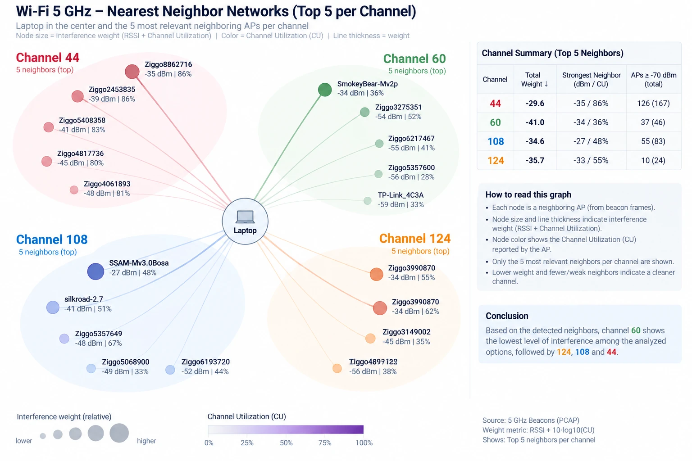

# Neighbor-network rooms for the RDK and prplMesh EasyMesh labs

**Status:** Proposed implementation design; no runtime or implementation changes made.

**Prepared:** 9 September 2026.

**Delivery approach:** Small, independently verifiable milestones in a future development branch. Existing rooms and default behavior remain the regression baseline.

## 1. What we are adding

We will add repeatable rooms that surround our EasyMesh network with independent neighboring Wi-Fi networks. Those neighbors will transmit beacons and, in congestion scenarios, exchange traffic with their own clients. Their channels, signal strengths, activity and positions will change according to a recorded scenario.

RDK and prplMesh will encounter these conditions through their normal wireless interfaces. Their agents should discover neighboring BSSs, measure the local channel environment, and report through existing EasyMesh paths. Their controllers should apply whichever native channel-management functions the installed implementation actually supports and has enabled.

The lab will supply the environment, run experiments and show the evidence. It will not supply a hidden list of the correct neighbors or the preferred channel to the controller during native-policy tests.

The enhancement has five parts:

1. **Neighbor actors:** independent APs and traffic-generating stations in the simulated RF medium.
2. **Room scenarios:** deterministic signal, channel and traffic timelines, including spatial differences between mesh agents.
3. **Qualified RF and telemetry support:** contention that affects traffic, and measurements that reach the native wireless and EasyMesh stacks.
4. **Platform adapters and tests:** common experiment operations mapped to the existing RDK and prplMesh interfaces.
5. **Interactive evidence:** a neighbor graph, room view, channel summary and event timeline showing what was configured, what each agent observed, and what the controller did.

An autonomous channel optimizer is a separate capability to evaluate. Having scan and channel-selection messages in an EasyMesh implementation does not establish that it will independently select a better channel under congestion. If the installed policy cannot do this, the result becomes an explicit implementation requirement rather than a lab workaround.

## 2. Reference example and intended interpretation



*Figure 1. User-provided example from fourth-floor captures. The laptop represents one observation point; in the lab, any EasyMesh agent can be selected as that observer. The underlying PCAP files have not been supplied or analyzed for this design.*

The new rooms should reproduce the **conditions illustrated by the picture**, including strong and weak neighbors, busy and quiet channels, and different views from different locations. They should also let us test changes over time.

The requested display encoding takes precedence over the mixed labels in the original picture:

| Visual property | Intended meaning |
| --- | --- |
| Node area | A documented relative relevance score based on signal strength, utilization and applicable channel overlap |
| Hue | Channel or occupied channel block; also show a text label |
| Luminance | Advertised channel utilization, with a fixed visible legend |
| Line thickness | Directed coupling or estimated interference relevance to the selected observer |
| Outline or line style | Whether information is observed, modeled, stale or unavailable |

Three distinctions are essential:

- A neighbor's advertised BSS Load channel utilization describes the channel as measured by that neighbor. It is evidence about our environment, but it is not our own radio's measured utilization.
- RSSI measured at one laptop or agent does not establish the interference relationship between every pair of neighboring APs. The lab knows its configured pair relationships; the measured view may show them only when observations support them.
- The five displayed neighbors per channel are a presentation filter. Collection and evaluation must retain the complete available observations and disclose truncation. Many BSSIDs can belong to one physical AP, and multiple APs can report the same busy airtime; their utilization percentages must not simply be added.

The example's numerical channel ranking is illustrative, not an acceptance oracle. A lab channel becomes preferable only under the defined scenario, actual measurements, operating constraints and performance evidence.

## 3. What already exists and what remains unproven

This assessment uses the repository's documented RDK baseline and inspected upstream component sources. It is not a fresh audit of either running host. The release record places RDK on rev140 and prplMesh independently on rev150; the exact deployed prplMesh source and HAL configuration still need to be recorded. [Release acceptance](https://github.com/boardfarmdevs/meta-cmf-bananapi-vcpe/blob/b82cce9fd362dd93313286f910583e685afe8e9a/doc/easymesh/reference/release-0908-acceptance.md)

| Area | Evidence already available | Work needed for this enhancement |
| --- | --- | --- |
| Rooms and RF timelines | Layouts, walls, mobility, deterministic directed SNR, golden plans and restoration exist | Add external AP/station roles, channel and traffic schedules, and neighbor-specific rooms |
| Wireless actors | The lab runs real wireless processes over hwsim; Linux supports hostapd and wpa_supplicant with hwsim | Package independent neighbor APs and associated stations with isolated LANs |
| Medium behavior | Current wmediumd supports SNR-dependent delivery, retries, airtime scheduling and exact-frequency isolation | Qualify contention, scan reception and per-observer busy measurements |
| Collision/interference accounting | Optional same-frequency interference exists in the patched engine but is disabled in the generated baseline | Evaluate it in a separate experimental profile; establish what it models before enabling it for rooms |
| Channel overlap | Different center frequencies are isolated; partial spectral overlap is not modeled | Begin with qualified 20 MHz cases; add overlap only behind a later fidelity gate |
| RDK scan and statistics plumbing | Inspected OneWifi code invokes native neighbor-scan and radio-statistics HAL functions; Unified Wi-Fi Mesh has channel scan/report and selection code | Verify the exact deployed versions, build flags, hwsim implementation and complete reporting path |
| prplMesh scan and channel tasks | Inspected source includes channel-scan handling, scan-result TLVs and channel-selection tasks | Verify installed backend support, returned fields, configuration and actual autonomous behavior |
| Native optimization | Existing room steering and a lab channel-width recommendation helper are useful infrastructure | Neither proves autonomous, congestion-driven channel selection in the deployed controllers |
| Visualization and evidence | Room views, topology, telemetry and run records already exist | Add neighbor observations, freshness, decision events and an explicit configured/observed comparison |

The current RF model uses simplified error curves and does not model full HE/EHT behavior or partial channel overlap. The layer also contains an hwsim channel-width clamp to 20 MHz. Wide-channel scenarios must therefore be a later qualification task, not an assumption based on advertised capabilities. [Medium model and limits](https://github.com/boardfarmdevs/meta-cmf-bananapi-vcpe/blob/b82cce9fd362dd93313286f910583e685afe8e9a/doc/easymesh/reference/wmediumd-internals.md), [OneWifi layer integration](https://github.com/boardfarmdevs/meta-cmf-bananapi-vcpe/blob/b82cce9fd362dd93313286f910583e685afe8e9a/recipes-ccsp/ccsp/ccsp-one-wifi.bbappend)

The existing configurator supplies the right starting point: compiled inputs, fixed physical identities, time-based RF changes and captured-state restoration. Its current role and export restrictions must be extended deliberately; neighbor and backhaul interactions are not automatically covered by adding more icons. [Configurator design](https://github.com/boardfarmdevs/meta-cmf-bananapi-vcpe/blob/b82cce9fd362dd93313286f910583e685afe8e9a/doc/easymesh/reference/wmediumd-configurator.md)

## 4. Responsibility split

| Capability | Build in the common lab | Ask of RDK and prplMesh |
| --- | --- | --- |
| Neighbor discovery | Independent BSSs emitting real beacon/probe-response frames | Discover them through native scan operations and return results with identity, channel, signal and age |
| Neighbor activity | Associated foreign clients exchanging controlled traffic over Wi-Fi | Measure the resulting local radio conditions through the normal driver/HAL path |
| Advertised BSS Load | Optional, controlled beacon information for parsing tests; measured values when supported | Preserve presence, value, units and origin through agent/controller reporting |
| Off-channel observation | Candidate channels populated with neighbors; continuous service probes | Expose scan capabilities, perform bounded scans, report busy/unsupported/partial outcomes and service impact |
| Environment reporting | Collect and compare native outputs with an independent experiment record | Deliver fresh channel/neighbor information through existing EasyMesh and northbound interfaces |
| Channel actuation | A separate test mode that issues an explicit operator-style request | Use native channel preference/selection, radio reconfiguration and operating-channel reporting |
| Autonomous response | Repeatable stimulus and outcome measurements | Use the enabled native channel policy, or explicitly identify the missing policy capability |
| Service continuity | Existing mesh clients plus traffic, association and backhaul probes | Preserve normal security, DHCP/IP reachability, steering, association and backhaul recovery behavior |
| Explanation | Render observations, configured conditions and controller events | Expose decisions, constraints and outcomes sufficiently to explain behavior |

A missing lab radio measurement should be fixed in the simulated hardware/driver or HAL boundary. A missing protocol field should be fixed in agent/controller transport. A missing decision should be addressed in the native policy. These are different deliverables and must be tracked separately.

## 5. Target architecture

```text
Room definition + actor inventory + deterministic event plan
       |                        |
       | RF relationships       | AP/channel/traffic lifecycle
       v                        v
 Shared hwsim/wmediumd <--> Neighbor APs <--> Their own stations
       |
       | Normal simulated Wi-Fi frames and radio measurements
       v
 RDK or prplMesh radio driver / HAL
       |
 Agent: scan, local statistics, EasyMesh reports
       |
 Controller: topology, channel preferences, native policy
       |
 Native channel-selection and operating-channel reporting
       v
 Mesh radios, backhaul and existing clients

 Independent observer collects:
 scenario events + medium counters + native reports + actions + traffic
       |
       v
 Common run record --> Room view / neighbor graph / result report
```

RDK and prplMesh use the same versioned scenario definitions and result contracts. They retain their separate deployments and radio inventories. Paired runs use equivalent roles and calibrated conditions, not shared physical radio ownership. Each run has one recorded owner for channel decisions.

### 5.1 Neighbor actors

Start with one Linux neighbor AP running hostapd and one associated station running wpa_supplicant. Reuse the existing lightweight client/container approach, including Alpine where appropriate. Run traffic between the neighbor station and a server behind its AP so packets cross the Wi-Fi medium; namespace isolation must prevent a host-local or Ethernet shortcut. This uses an established hwsim execution model. [Linux hwsim documentation](https://wireless.docs.kernel.org/en/latest/en/users/drivers/mac80211_hwsim.html)

Each actor definition includes:

- Stable actor and physical-radio identity; BSSID/SSID belong to the configured BSS.
- Channel, operating class and width; security settings and optional BSS Load configuration.
- Position, wall attenuation and directed RF relationships to mesh radios, mesh clients and other foreign radios as relevant.
- Station associations and traffic profiles: idle, steady uplink/downlink, bursts and start/stop times.
- Presence intervals, lifecycle state and resource limits.

Foreign APs do not participate in our EasyMesh onboarding and do not share our management or LAN bridge. They share only the intended RF environment. Multiple BSSs on one radio must retain that common radio identity; they are not independent airtime resources.

Provision additional radios before starting the experimental lab. The documented accepted RDK roster already has 25 active radio owners; the available spare pool must be verified before allocating neighbors. A picture showing 20 BSSs does not imply that 20 additional APs and their clients fit the current inventory. Recreating hwsim invalidates radio identities and belongs to provisioning, never an ordinary room transition. [Radio ownership model](https://github.com/boardfarmdevs/meta-cmf-bananapi-vcpe/blob/b82cce9fd362dd93313286f910583e685afe8e9a/doc/easymesh/reference/single-wiphy-radio-model.md)

### 5.2 Three fidelity levels

| Level | What the room establishes | What it may claim |
| --- | --- | --- |
| F1: Discovery | Real beacon/probe frames, controlled channel and RSSI; optionally scripted BSS Load | Scan visibility, parsing, reporting, freshness and visualization |
| F2: Contention | Real neighbor traffic, qualified medium scheduling/interference behavior, per-radio busy measurements | Comparative co-channel congestion and channel-change experiments within the validated model |
| F3: Advanced RF | Qualified channel-width/overlap, hidden-node and other extended behavior | Only the additional effects explicitly validated by that profile |

Every room and result records its fidelity level. Advertising 85% utilization while sending no traffic is an F1 field-handling test. It must not be presented as proof of F2 congestion or of an optimizer's performance benefit.

For F2, first measure the current scheduler, then evaluate optional interference accounting. If additional modeling is necessary, add it behind an experimental profile with the old profile preserved. A configuration switch alone is not a fidelity test.

### 5.3 Local busy measurements

Before using congestion to judge either controller, prove the full measurement path:

```text
Neighbor airtime at a receiving radio
    -> medium/driver accounting
    -> local channel survey or equivalent HAL statistics
    -> agent report
    -> controller model / northbound observation
```

Specify active time, busy time, own transmit/receive time and noise availability per radio, frequency and measurement interval. Define reset and retune behavior. Busy time represents a union of busy intervals, not an unbounded sum of simultaneous transmitters. Observation outside a radio's tuned/dwell interval must not masquerade as a fresh survey. The Linux survey interface defines counters such as active and busy time, but field support must be checked for the actual driver. [cfg80211 survey interface](https://kernel.org/doc/html/next/driver-api/80211/cfg80211.html)

Prefer a common simulated driver/survey implementation when practical. If platform-specific hwsim HAL integration is required, both adapters must consume the same defined medium measurements and expose provenance. Do not insert scenario target values directly into the controller database or label unavailable noise/occupancy as measured zero.

If this path is absent, discovery milestones can still pass. Congestion-policy qualification remains blocked until the path is implemented and validated, or the scenario is moved to suitable physical radios.

### 5.4 Scan behavior and continuous service

Use native scan APIs first. Agents do not need to become permanent PCAP collectors to discover neighboring BSSs. Capture is an independent diagnostic tool.

Discover scan capabilities per radio: channels, supported scan types, dwell constraints, minimum interval, on-boot restrictions and service impact. Schedule supported scans without overlapping incompatible operations. Record queueing, rejection, partial completion, completion time and maximum service interruption. A shared wiphy does not by itself specify the actual scan impact across all logical radios; test the installed driver/HAL behavior.

Capture EasyMesh messages on the supported bridge path. Raw 802.11 capture needs its own qualified startup option: the current documentation warns that dynamically enabling hwsim monitoring is unsafe with the accepted launcher. A bridge capture contains decapsulated EasyMesh traffic, not the neighboring beacon frames. [Capture paths and limits](https://github.com/boardfarmdevs/meta-cmf-bananapi-vcpe/blob/b82cce9fd362dd93313286f910583e685afe8e9a/doc/easymesh/reference/packet-capture.md)

### 5.5 Common data and adapter contract

The following are proposed logical operations, not claims that either platform already exposes an API with these names:

| Logical operation | Required outcome |
| --- | --- |
| Read capabilities | Actual supported scans, fields, channels, widths, action interface and native policy state |
| Request fresh scan | Correlated accepted/rejected/pending/completed result, requested channels and timing |
| Read neighbor observations | Observer radio, BSSID, SSID, channel/width, signal, optional BSS Load and freshness |
| Read channel measurements | Observer radio, channel, measurement window, local utilization and available supporting counters |
| Read channel preferences | Candidate constraints and preference information available from the native implementation |
| Request channel change | Native command response followed by separately observed operating channel and continuity outcome |
| Read policy events | Decision/action times and available reasons, including no-action or failure outcomes |

Use separate records for **scenario truth**, **observations** and **actions**. A neighbor observation is keyed by observer radio, neighbor BSSID and scan/time context; never overwrite several agents' observations with one global RSSI.

Retain raw units and normalized values. For example, BSS Load channel utilization uses an 8-bit encoding, while some APIs return percentages; RCPI and RSSI are also different representations. Handle unavailable/reserved encodings explicitly. A missing BSS Load element is `unavailable`, not 0% utilization. Missing bandwidth must remain unknown even if a backend supplies a default; preserve that qualification when detectable.

Each measurement needs collection time, measurement window where available, source, validity and age. Unsupported, missing, partial, stale, timed out and failed are distinct states. Aggregate multiple reports only within documented time windows and preserve the individual records.

### 5.6 Room and event schema

Extend the existing declarative world system with versioned optional neighbor definitions. Keep old inputs and golden outputs unchanged when the enhancement is disabled. Separate geometry/RF events from actor lifecycle and traffic events, then compile them into one auditable timeline. Only RF batches supported by the existing socket are atomic; cross-process traffic and channel events need acknowledgements and recorded actual timestamps.

Illustrative proposed room, not an executable current schema:

```yaml
schema_version: 2
room_id: neighbor-cochannel-step
fidelity: F2
seed: 44
platform_bindings: external
decision_mode: observe_only
required_capabilities:
  - fresh_neighbor_scan
  - local_channel_utilization
  - qualified_cochannel_contention
neighbors:
  - id: neighbor_a
    radio_role: foreign_ap_a
    station_roles: [foreign_sta_a]
    ssid: lab-neighbor-a
    channel: 36
    width_mhz: 20
    rf_profile: strong_at_agent_1_weak_at_agent_2
timeline:
  - at_s: 0
    event: baseline_start
  - at_s: 30
    event: neighbor_a_traffic_start
    profile: sustained_downlink
  - at_s: 150
    event: neighbor_a_traffic_stop
  - at_s: 210
    event: restore_and_verify
candidate_channels: [36, 44]
```

Traffic rate, scan cadence, thresholds and durations become frozen test parameters after calibration. A traffic profile states offered load and records achieved throughput/airtime; it does not promise a utilization value without measurement. Candidate channels must be supported and allowed by the actual experimental profile.

Use stable physical relationships across channel changes and client roams. Geometry must continue to apply when a mesh AP changes frequency; a profile bound only to its starting channel would create a false clean-channel result. Explicit room intent is required before changing protected mesh backhaul links.

## 6. Platform-specific implementation work

### 6.1 RDK: OneWifi, Wi-Fi HAL and Unified Wi-Fi Mesh

The inspected OneWifi radio-statistics implementation calls `wifi_startNeighborScan`, `wifi_getNeighboringWiFiStatus` and `wifi_getRadioChannelStats`. The inspected HAL parses BSS Load information, and Unified Wi-Fi Mesh contains channel scan/report and channel-selection handling. These are integration points to verify in the deployed build, not new parallel mechanisms to invent. [OneWifi statistics](https://github.com/rdkcentral/OneWifi/blob/83847dc9046b91f12b1ba2fc894add60b5ceda91/source/stats/wifi_stats_radio_channel.c), [HAL scan parsing](https://github.com/rdkcentral/rdk-wifi-hal/blob/84b283b017d8f621ba358f53f801132dfd9f32df/src/wifi_hal_nl80211.c), [Unified Wi-Fi Mesh channel handling](https://github.com/rdkcentral/unified-wifi-mesh/blob/afa33a76648c428e325137e1048dd34184fa2efa/src/em/channel/em_channel.cpp)

| Task | Specific implementation work |
| --- | --- |
| RDK-01: Resolve capabilities | Record exact component revisions, hwsim patches, scan build flags and effective OneWifi/controller configuration |
| RDK-02: Exercise scans | Trace one fresh request through controller, agent, OneWifi and HAL; verify neighbor discovery on current and supported off-channel frequencies |
| RDK-03: Complete telemetry | Trace local channel statistics and neighbor BSS Load separately through HAL, OneWifi translation, EasyMesh reports and controller model; fix only demonstrated gaps |
| RDK-04: Verify action path | Exercise native preference/selection and radio update handling; confirm the live operating channel and all affected logical VAPs |
| RDK-05: Evaluate native policy | Establish whether the installed controller has a runtime congestion policy, its inputs and configuration, and whether it can reconsider channels after startup |
| RDK-06: Preserve baseline | Run the existing client, steering, topology and reporting checks after every integration change |

OneWifi's inspected documentation lists a 5 GHz off-channel scan feature flag as disabled by default; check the actual image before drawing conclusions. The release acceptance also records a reporting-activation weakness requiring an explicit replay on one extender. Readiness for these experiments must verify actual fresh reporting from every required radio, including idle APs, rather than trusting a successful enable response. [OneWifi build options](https://github.com/rdkcentral/OneWifi/blob/83847dc9046b91f12b1ba2fc894add60b5ceda91/README.md), [Release reporting caveat](https://github.com/boardfarmdevs/meta-cmf-bananapi-vcpe/blob/b82cce9fd362dd93313286f910583e685afe8e9a/doc/easymesh/reference/release-0908-acceptance.md)

### 6.2 prplMesh: installed WLAN HAL, agent tasks and controller policy

The inspected prplMesh agent has channel scan request/report handling and conditionally includes neighbor BSS Load fields. Its controller has channel-selection tasks. The inspected configuration documentation lists both `ChannelSelectionTaskEnabled` and `DynamicChannelSelectionTaskEnabled` as false by default; this does not establish the settings on rev150. [Agent scan task](https://gitlab.com/prpl-foundation/prplmesh/prplMesh/-/blob/55a29b70619ecfcbe8978603cd7036931f8cd685/agent/src/beerocks/slave/tasks/channel_scan_task.cpp), [Configuration](https://gitlab.com/prpl-foundation/prplmesh/prplMesh/-/blob/55a29b70619ecfcbe8978603cd7036931f8cd685/documentation/prplMesh-configuration.md)

| Task | Specific implementation work |
| --- | --- |
| PRPL-01: Resolve capabilities | Record repository/commit, build options, actual WLAN HAL backend, radio ownership and effective controller task settings |
| PRPL-02: Exercise scans | Trace scan capabilities and requests through the agent task and selected HAL; verify fresh results and unsupported/busy/partial status handling |
| PRPL-03: Complete telemetry | Check that the backend fills local scan utilization, neighbor RSSI/RCPI, width and optional BSS Load, and that these reach the controller and observer |
| PRPL-04: Verify action path | Exercise native channel-selection tasks and operating-channel reporting; observe CSA/reconfiguration and backhaul/client recovery |
| PRPL-05: Evaluate native policy | Determine whether the enabled dynamic task makes congestion-driven decisions or only orchestrates scans/requests; verify the actual policy inputs |
| PRPL-06: Preserve baseline | Repeat onboarding, topology, metrics, steering and restart/recovery tests on the independent prplMesh deployment |

A concrete telemetry audit item exists in the inspected upstream scan task: it replaces a zero scan-utilization byte with `10` as a test-script workaround. Determine whether the deployed revision contains this behavior. Preserve raw provenance and resolve or explicitly qualify it before treating reported idle-channel values as accurate. Do not silently subtract an assumed offset in the lab adapter. The same inspected source conditionally emits BSS Load fields, so an older comment claiming those fields are always absent is not sufficient evidence of a current limitation. [Scan-result construction](https://gitlab.com/prpl-foundation/prplmesh/prplMesh/-/blob/55a29b70619ecfcbe8978603cd7036931f8cd685/agent/src/beerocks/slave/tasks/channel_scan_task.cpp#L1637)

### 6.3 Concrete questions for both implementation teams

These are the capability requests to resolve during the first milestone:

1. Which installed API requests a fresh per-radio scan, and what limits and service impact apply?
2. Which neighbor fields and local channel measurements reach the controller today, with what units and freshness?
3. Does the native controller consume neighboring BSS Load, local utilization, noise, traffic performance, or only a subset?
4. Is there an enabled runtime channel-optimization policy? What triggers it, and how does it avoid oscillation?
5. How are channel preferences, regulatory restrictions, width and wireless backhaul dependencies honored?
6. Which supported interface requests an explicit channel change, and what independently confirms success or refusal?
7. What decision and failure information can the lab observe without introducing a new decision engine?

## 7. Room catalog

| Room | Conditions to create | Behavior to evaluate | Earliest fidelity |
| --- | --- | --- | --- |
| N0: Existing baseline | No foreign APs or traffic | Existing functionality remains unchanged | Existing |
| N1: Quiet neighbor | One strong visible AP with little traffic | Correct discovery; visibility alone need not trigger a move | F1 |
| N2: Co-channel load | Strong neighbor on our channel, sustained traffic, qualified clean alternative | Local congestion is measurable; compare continued operation and channel migration | F2 |
| N3: Signal versus load | Strong quiet neighbor and weaker busy neighbor | Native behavior reflects its measured inputs rather than AP count or RSSI alone | F2 |
| N4: Several channel groups | Multiple BSSs across several supported channels; progressively increase density | Complete reporting, pagination/truncation handling and readable top-five display | F1 for reporting; F2 for congestion |
| N5: Different agent views | Neighbor close to one extender and weak at another | Per-agent observations differ; controller actions account for affected radios and backhaul | F2 |
| N6: Bursts and recovery | Short bursts, sustained load, then quiet | Transient tolerance, sustained response and no repeated channel oscillation | F2 |
| N7: No better channel | All eligible alternatives are similarly loaded or constrained | A stable no-change decision is acceptable; no harmful migration loop | F2 |
| N8: Missing/stale data | BSS Load absent, scans delayed/rejected, old observations expire | Unknown data stays unknown; incomplete information is visible | F1 |
| N9: Backhaul-sensitive change | Congested radio also supports wireless backhaul | Native coordination and bounded service recovery | F2 after actuation qualification |
| N10: Overlap and hidden nodes | Qualified wide-channel overlap or asymmetric carrier sensing | Advanced policy behavior within explicitly validated RF limits | F3 |

Reproduce the picture's channel groups only when the chosen radio/regulatory profile permits them. Begin with simple supported 20 MHz candidates. DFS behavior, wide channels and 6 GHz require separate capability gates.

PCAP-derived room import is a later convenience: extract BSSID, channel/width, observed signal, BSS Load and timing into a versioned input file with provenance. A single capture location cannot supply a complete AP-to-AP RF matrix or reconstruct actual traffic demand. Missing geometry and load profiles remain explicit modeling assumptions.

## 8. Interactive room and neighbor views

Add a neighbor-room mode to the existing UI. Preserve the current default view and its controls. The new mode provides:

- A spatial room view with mesh APs, existing clients, foreign APs and foreign stations visually distinct.
- A selected-agent neighbor graph corresponding to Figure 1, grouped by channel with a top-N control.
- A channel view showing occupied width, our operating channel, neighbor-advertised utilization and our own measured utilization as separate values.
- A timeline aligning scenario traffic changes, scans, reports, decisions, channel changes and client/backhaul interruptions.
- A comparison between configured conditions and native observations, with source and timestamp visible on inspection.
- A native topology/CLI view alongside the RF environment. Foreign BSSs remain environment objects, not onboarded mesh agents.

For the initial visual score, use a versioned, bounded heuristic such as:

```text
edge_relevance(observer, neighbor, candidate_channel)
  = signal_factor(observed_RSSI)
    × advertised_utilization_fraction
    × qualified_overlap_factor
```

This is a display heuristic, not a physical interference measurement or the native controller's algorithm. `signal_factor` is monotonic and documented. Missing utilization produces an unknown score and a visible node, not a zero-size disappearance. F1/F2 overlap is binary for the qualified 20 MHz model. A geometric overlap estimate may be shown separately, but it must not imply that the medium simulates it.

Node **area** follows the score, with bounded minimum and maximum display sizes. Keep channel hue fixed while varying luminance according to the legend. Use outlines and line styles for provenance so they do not alter the utilization encoding. Changing the graph's score or top-N setting must never alter RF conditions or native policy inputs.

## 9. Milestones and acceptance gates

All milestones below are **planned**. Dependencies are evidence gates, not calendar estimates. Each platform can complete a capability milestone independently, but a comparison must show both statuses.

| Milestone | Deliverable | Dependency | Completion evidence |
| --- | --- | --- | --- |
| M0 | Frozen baseline and capability matrix | None | Exact versions, settings, known gaps and passing baseline evidence |
| M1 | One independent neighbor AP/station pair | M0 | Real frames and isolated Wi-Fi traffic with deterministic lifecycle |
| M2 | Native neighbor discovery on both platforms | M1 | Correlated scan request, result, report and observed graph data |
| M3 | Qualified congestion and local measurements | M2 | Traffic impact and consistent per-radio busy telemetry |
| M4 | Reusable neighbor rooms and interactive evidence | M2; M3 for F2 claims | Deterministic room suite, complete observations and usable views |
| M5 | Verified native channel-change control | M3 | Accepted/refused request, actual channel and continuity outcome |
| M6 | Native autonomous-policy evaluation | M4 and M5 | Repeated, explained responses or explicit native-policy gaps |
| M7 | Compatibility, scale and release qualification | M6 for full release | Old rooms pass, resource bounds and recovery proven, evidence packaged |
| M8 | Advanced RF and capture-derived scenarios | M7 core release | Separate fidelity proofs for each added capability |

### M0 — Freeze the baseline and capability contract

**Common work:** Record exact image/source/kernel/medium versions, radio inventory, room hashes, current policy owners and effective settings. Define test modes: observe-only, commanded-channel and native-autonomous. Freeze measurement units, freshness rules and proposed run schema. Set service-loss and recovery budgets from baseline measurements before outcome testing.

**RDK work:** Resolve OneWifi, HAL and Unified Wi-Fi Mesh revisions and hwsim patches. Verify actual periodic reporting for every required agent/radio and preserve the documented cold-start caveat.

**prplMesh work:** Resolve the deployed repository/commit, selected HAL backend, configuration and scan/selection task capabilities. Do not infer them from upstream defaults.

**Deliverables:** Versioned capability matrix with `verified`, `source-present/unverified`, `missing` or `unsupported` for each feature; baseline run bundle; written experiment modes.

**Gate:** Existing baseline behavior is reproducible, known defects are explicit, and each later test can distinguish a lab limitation from an implementation limitation. No unknown capability is counted as supported.

### M1 — Add the smallest independent neighbor network

**Common work:** Provision one foreign AP and station in the experimental inventory. Establish their isolated LAN and wireless traffic path. Add stable roles, channel configuration, deterministic signal settings, actor readiness and cleanup. Start with a quiet 20 MHz BSS; add traffic generation without yet claiming calibrated congestion.

**RDK work:** Bind the new actors into the RDK experimental medium without changing existing mesh identities or provisioning the running baseline.

**prplMesh work:** Apply the same actor package to the independent prplMesh experimental medium with equivalent RF relationships.

**Deliverables:** N1 actor fixture, resource inventory and lifecycle logs.

**Gate:** Beacons and station traffic traverse the intended simulated air path. Foreign devices do not onboard or leak onto the mesh LAN. Start/stop and cleanup preserve the original topology and client connectivity.

### M2 — Prove native scanning and neighbor reporting

**Common work:** Implement the common observation schema and minimal adapters. Trigger a supported fresh scan; test on-channel and supported off-channel discovery. Vary RSSI, channel, BSS Load presence and age. Compare native reports with actor configuration and frame evidence. Render a minimal selected-agent neighbor view.

**RDK work:** Trace the request through Unified Wi-Fi Mesh, OneWifi and HAL, then trace results back to the controller. Identify missing translation or hwsim scan support precisely.

**prplMesh work:** Trace the channel scan task through its actual backend and result TLVs. Verify optional BSS Load handling, units, result age and any value substitution.

**Deliverables:** N1/N8 discovery tests; per-platform adapter mappings; raw and normalized scan records.

**Gate:** Each capable platform reports the expected BSSID, channel and signal change from real frames. Missing fields and failed scans are explicit. Off-channel scans have a measured service-impact budget. This milestone claims discovery only.

### M3 — Make congestion real and visible to the implementations

**Common work:** Calibrate idle, low-load and high-load neighbor traffic. Measure same-channel traffic impact versus a separate-channel control. Evaluate the current scheduler and optional interference mode. Add or repair per-radio survey/busy accounting if necessary, with measurement intervals and retune/reset semantics. Preserve the accepted medium profile unchanged.

**RDK work:** Verify local counters through `wifi_getRadioChannelStats`, OneWifi and the native reporting path. Isolate any hwsim HAL implementation work from controller policy.

**prplMesh work:** Verify the selected backend exposes equivalent local scan/channel measurements and that the agent/controller preserve them. Qualify the zero-utilization workaround if present.

**Deliverables:** F2 medium profile; calibration report; N2 traffic-and-telemetry test; list of unsupported measurements.

**Gate:** Neighbor traffic produces repeatable local contention/performance effects and corresponding radio measurements. A quiet or isolated channel supplies a valid control. High advertised BSS Load alone cannot pass the gate. If fidelity is insufficient, stop F2 claims and retain the useful F1 release path.

### M4 — Build the room suite and explanatory UI

**Common work:** Extend the versioned room compiler, actor scheduler and run journal. Implement N1–N8 at their supported fidelity levels. Add selected-observer, channel-group and spatial views, top-N filtering, provenance, freshness and the event timeline. Record actual event acknowledgements when timing differs from the plan.

**RDK work:** Integrate native observations and topology identifiers into the common view; retain current room controls and default behavior.

**prplMesh work:** Supply equivalent observations and topology mappings through its adapter, displaying unsupported fields explicitly.

**Deliverables:** Named room catalog, golden compiled plans, UI inspection scenarios and replayable result bundles.

**Gate:** Identical input and seed produce identical planned conditions. Recorded native outcomes may vary and remain visible. Filtering does not discard collected evidence or change the experiment. Room exit restores owned changes and verifies the expected state.

### M5 — Verify native channel-change control separately from policy

**Common work:** In commanded-channel mode, establish channel preferences and issue one supported operator-style request. Record rejection/acceptance, actual radio channel, client association, IP traffic, packet loss and recovery. Begin with wired backhaul or an unaffected backhaul radio; add N9 only after that succeeds.

**RDK work:** Follow the existing controller/agent/OneWifi radio change path. Verify operating channel and affected VAPs rather than relying on the CLI response alone.

**prplMesh work:** Follow the native selection task and HAL path. Verify operating-channel reports, actual radio state and client/backhaul behavior.

**Deliverables:** Successful and refused-action traces; continuity results; common action-result mapping.

**Gate:** A successful request is independently confirmed at the radio and service level. Unsupported or constrained changes fail clearly. Native radio coordination handles the action; the test does not modify RF conditions to manufacture an improvement.

### M6 — Evaluate the existing autonomous channel policies

**Common work:** Run observe-only controls and native-autonomous trials with the same room inputs and offered traffic. Use N2, N3, N5, N6 and N7 first. Stop test-issued channel requests during autonomous trials. Record actual policy settings, decisions, timing, service effects and channel stability. Use at least three paired repetitions per initial condition, then increase repetitions when variance prevents a conclusion.

**RDK work:** Enable/configure only a verified native policy in the experimental profile. Identify its inputs and decision path. If runtime congestion optimization is absent, produce a scoped native-controller backlog item with the missing inputs and required behavior.

**prplMesh work:** Evaluate the actual behavior of the installed channel/dynamic-selection tasks. Distinguish a scan scheduler or request orchestrator from an autonomous optimizer. Record missing functionality as a platform task.

**Deliverables:** Per-platform behavior report, evidence-backed gaps and any proposed native-policy enhancement design.

**Gate:** Results explain whether the native stack observes, decides, acts and recovers. No-action can be valid for transient load, constrained alternatives or no better channel. A controller without the required policy is marked unsupported; an external lab optimizer must not make it appear to pass.

### M7 — Qualify compatibility, recovery and practical scale

**Common work:** Run all existing rooms with the feature disabled. Re-run with idle neighbor infrastructure present. Exercise experiment interruption, actor failure, stale scans, repeated room switches and restoration. Increase external radio/BSS counts incrementally while measuring CPU, memory, scan latency, report truncation, event lag and medium capacity.

**RDK work:** Re-run native reporting activation, topology, association, existing steering, DHCP/IP traffic and service recovery checks against the recorded baseline.

**prplMesh work:** Re-run corresponding onboarding, metrics, steering, client traffic and recovery checks with its pinned configuration.

**Deliverables:** Compatibility report, qualified density limits, operator instructions, rollback procedure and packaged evidence.

**Gate:** No unexplained regression in existing functionality; finite resource and recovery bounds; explicit comparison status for each platform. Hundreds of BSSs are not claimed until tested. Preserve a discovery-only release option if F2 or native optimization remains unsupported.

### M8 — Add advanced scenarios as separate increments

**Common work:** Add capture-to-room import, width-aware overlap, hidden-node cases, larger density, additional bands and DFS-related cases one capability at a time. Decide whether each needs medium/driver work or physical-radio validation. Keep the F1/F2 suite intact.

**RDK work:** Revisit hwsim width limitations and HAL capability reporting before enabling wider-channel tests; qualify the actual hardware path where the simulator is insufficient.

**prplMesh work:** Qualify matching capabilities in its installed backend and verify that width/channel decisions and reports remain consistent.

**Deliverables:** Separate F3 capability profiles and validation reports, with explicit supported and unsupported effects.

**Gate:** An advanced display or advertised width never substitutes for a functioning RF model. Each new claimed effect has a control experiment and repeatable evidence.

## 10. Validation, comparison and result interpretation

Use one common result format while retaining raw native outputs. Every run should include:

| Evidence | Purpose |
| --- | --- |
| Build/configuration manifest | Reproduce the installed code, enabled policy and medium profile |
| Room source, seed, plan hash and bindings | Reproduce the intended environment and radio ownership |
| Scenario and actor event journal | Compare planned and actual stimulus timing |
| Neighbor and local channel measurements | Establish what each agent and controller could know |
| EasyMesh requests/reports and native logs | Trace transport, decisions and action outcomes |
| Radio, station and backhaul state | Independently verify topology and operating-channel changes |
| Offered traffic, achieved throughput, latency and loss | Measure service impact and benefit |
| Restoration report | Prove owned changes were undone and the expected baseline returned |

The principal measurements are discovery latency, scan duration/service interruption, observation age and completeness, local utilization response, decision latency, actual channel-change latency, traffic disruption, recovery time and channel-change count. State measurement windows and data exclusions. Compare performance under equivalent offered traffic and receiver conditions.

Freeze numeric tolerances after M0/M3 calibration and before policy comparison. Do not choose thresholds retrospectively to make a controller pass. Repeated runs should report spread, not just the best result.

Use these outcome labels consistently:

- **Passed:** Required behavior was demonstrated with the necessary fidelity and evidence.
- **Failed:** A supported capability did not meet the frozen test criteria.
- **Unsupported:** The implementation/profile does not provide the required capability.
- **Inconclusive:** Missing observations, insufficient RF fidelity or excessive run variance prevents a conclusion.
- **Not run:** Prerequisites or milestone work remain incomplete.

Discovery, protocol transport, explicit actuation and autonomous improvement receive separate outcomes. An accepted command is not evidence of a changed channel; a changed channel is not evidence of better service.

## 11. Keeping the existing system intact

The implementation should be additive and opt-in:

1. Develop later in a new branch and experimental image/profile. This document creates neither.
2. Preserve existing room schema behavior, golden outputs, default UI mode and baseline medium settings.
3. Provision neighbor radios and any changed medium settings before experimental startup. Do not rebuild the accepted lab's radio pool during a room switch.
4. Add capabilities and fields as optional/versioned extensions. Old adapters and rooms must remain usable.
5. Record one channel-decision owner per run. Leave normal client steering intact unless the specific test requires a documented experimental setting; record and restore every changed setting.
6. Snapshot owned RF overrides, neighbor lifecycle, traffic state and policy settings. Use the existing writer/lease and generation checks. Restore only experiment-owned state and detect conflicting changes rather than overwriting them.
7. Recover through the supported platform path when a controller changes channel. Restoring the SNR matrix alone does not restore radio channels or policy state.
8. Keep existing Alpine/wpa_supplicant clients, their configured 802.11k/v/r functionality and DHCPv4 behavior as regression subjects. Neighbor-room support does not require a new client control protocol.
9. Version any required kernel/medium/HAL changes independently from controller policy changes so regressions can be isolated and rolled back.

## 12. Suggested implementation slices

The exact file layout should be confirmed in M0. Existing areas to extend are the world compiler/runner under `gen/wmediumd/configurator/`, the room orchestration under `gen/demo/room_demo/`, the existing room viewer, and platform adapters. New directories or API names below are proposals, not existing interfaces.

| Slice | Scope | Review boundary |
| --- | --- | --- |
| 1 | Capability manifest, common observation/result schema and baseline fixtures | No runtime behavior change |
| 2 | Neighbor actor provisioning and lifecycle | One AP/station pair; isolated and removable |
| 3 | RDK scan/observation adapter | Native discovery evidence; narrowly scoped HAL fixes only if demonstrated |
| 4 | prplMesh scan/observation adapter | Same contract, actual backend behavior preserved |
| 5 | Experimental contention/survey profile | Medium/driver changes with calibration and old-profile regression tests |
| 6 | Neighbor room schema, compiler and scheduler | Deterministic plans, capability checks and restoration |
| 7 | Neighbor graph, channel view and evidence timeline | Display-only scoring and top-N filtering |
| 8 | Native channel-action adapters and continuity tests | Explicit command path, distinct from autonomous policy |
| 9 | Native-policy evaluation and any separately justified policy changes | Evidence-led RDK/prplMesh requirements |
| 10 | Compatibility, scale, packaging and documentation | Reproducible qualification with known limits |

The first useful delivery is **M2: a room containing a foreign AP that both implementations discover and report natively**. The next is **M3/M4: visible, measured congestion in repeatable rooms**. The full core evaluation completes at **M7**, with independent results for discovery, actuation and autonomous behavior on each platform.

## 13. Source baseline and unresolved decisions

Repository paths and upstream components were inspected at these revisions. Upstream source presence is not a claim about the deployed binaries:

| Source | Inspected revision |
| --- | --- |
| `boardfarmdevs/meta-cmf-bananapi-vcpe` documentation/layer | `b82cce9fd362dd93313286f910583e685afe8e9a` on the referenced `codex/0908-clean` line |
| Accepted RDK packaged source, per release document | `c1f163c1f8f44ef68bd3d2806d54ea7a7c4cad11` |
| `rdkcentral/OneWifi` | `83847dc9046b91f12b1ba2fc894add60b5ceda91` |
| `rdkcentral/rdk-wifi-hal` | `84b283b017d8f621ba358f53f801132dfd9f32df` |
| `rdkcentral/unified-wifi-mesh` | `afa33a76648c428e325137e1048dd34184fa2efa` |
| Upstream prplMesh | `55a29b70619ecfcbe8978603cd7036931f8cd685` |

M0 must resolve the deployed prplMesh revision/backend, deployed RDK component revisions and flags, spare radio capacity, scan service budgets and native channel-policy ownership. M3 must resolve the medium's usable contention fidelity and the local survey path. M6 must resolve whether a new native policy is required on either platform. Actual PCAP import remains optional until capture files are available.

Keep `assets/nearest-neighbor-networks.png` alongside this document when copying it into a repository so the reference figure remains portable.
